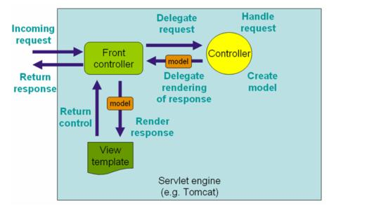

## SpringMVC 配置

1、MVC 框架作用：

1. 将 url 映射到 java 类或 java 类的方法
2. 封装用户提交的数据
3. 处理请求-调用相关的业务处理-封装响应数据
4. 将响应的数据进行渲染 jsp,html,freemaker 等

2、Spring MVC 是一个轻量级的基于响应的 MVC 框架

3、Spring MVC 优势

1. 性能比 Struts2 好
2. 简单，便捷，易学
3. 和 Spring 无缝集成（使用 spring ioc, aop）
4. 使用约定优先于配置
5. 能够进行简单 junit 测试
6. 支持 Restful 风格
7. 异常处理
8. 本地化，国际化
9. 数据验证，类型转换
10. 拦截器
11. 使用的公司多

4、结构



spring-beans
spring-context
spring-core
spring-web
spring-webmvc
commons-logging

项目目录

```
.
├── pom.xml
└── src
    ├── main
    │   ├── java
    │   │   └── com
    │   │       └── pengshiyu
    │   │           └── controller
    │   │               └── HelloController.java
    │   ├── resources
    │   │   └── springmvc-servlet.xml
    │   └── webapp
    │       ├── WEB-INF
    │       │   ├── jsp
    │       │   │   └── hello.jsp
    │       │   └── web.xml
    │       └── index.html
    └── test
        └── java
```

## 配置文件

pom.xml

```xml
<?xml version="1.0" encoding="UTF-8"?>
<project xmlns="http://maven.apache.org/POM/4.0.0"
         xmlns:xsi="http://www.w3.org/2001/XMLSchema-instance"
         xsi:schemaLocation="http://maven.apache.org/POM/4.0.0 http://maven.apache.org/xsd/maven-4.0.0.xsd">
    <modelVersion>4.0.0</modelVersion>

    <groupId>org.example</groupId>
    <artifactId>spring-mvc-demo</artifactId>
    <version>1.0-SNAPSHOT</version>

    <build>

        <plugins>
            <!-- tomcat7插件 maven 命令 tomcat7:run 启动项目-->
            <plugin>
                <groupId>org.apache.tomcat.maven</groupId>
                <artifactId>tomcat7-maven-plugin</artifactId>
                <version>2.2</version>
                <configuration>
                    <port>8080</port>
                    <path>/</path>
                    <uriEncoding>UTF-8</uriEncoding>
                    <!--添加忽略war包检查标签，则可以让tomcat7：run指令正常启动tomcat-->
                    <ignorePackaging>true</ignorePackaging>
                    <contextFile>src/main/webapp/WEB-INF/web.xml</contextFile>
                    <contextReloadable>true</contextReloadable>
                </configuration>
            </plugin>

        </plugins>
    </build>

    <dependencies>
        <!-- https://mvnrepository.com/artifact/org.springframework/spring-core -->
        <dependency>
            <groupId>org.springframework</groupId>
            <artifactId>spring-core</artifactId>
            <version>5.2.6.RELEASE</version>
        </dependency>
        <!-- https://mvnrepository.com/artifact/org.springframework/spring-beans -->
        <dependency>
            <groupId>org.springframework</groupId>
            <artifactId>spring-beans</artifactId>
            <version>5.2.6.RELEASE</version>
        </dependency>
        <!-- https://mvnrepository.com/artifact/org.springframework/spring-context -->
        <dependency>
            <groupId>org.springframework</groupId>
            <artifactId>spring-context</artifactId>
            <version>5.2.6.RELEASE</version>
        </dependency>
        <!-- https://mvnrepository.com/artifact/org.springframework/spring-web -->
        <dependency>
            <groupId>org.springframework</groupId>
            <artifactId>spring-web</artifactId>
            <version>5.2.6.RELEASE</version>
        </dependency>
        <!-- https://mvnrepository.com/artifact/org.springframework/spring-webmvc -->
        <dependency>
            <groupId>org.springframework</groupId>
            <artifactId>spring-webmvc</artifactId>
            <version>5.2.6.RELEASE</version>
        </dependency>

        <!-- https://mvnrepository.com/artifact/org.springframework/spring-aop -->
        <dependency>
            <groupId>org.springframework</groupId>
            <artifactId>spring-aop</artifactId>
            <version>5.2.6.RELEASE</version>
        </dependency>

        <!-- https://mvnrepository.com/artifact/org.springframework/spring-expression -->
        <dependency>
            <groupId>org.springframework</groupId>
            <artifactId>spring-expression</artifactId>
            <version>5.2.6.RELEASE</version>
        </dependency>


        <!-- https://mvnrepository.com/artifact/commons-logging/commons-logging -->
        <dependency>
            <groupId>commons-logging</groupId>
            <artifactId>commons-logging</artifactId>
            <version>1.2</version>
        </dependency>

        <dependency>
            <groupId>javax.servlet</groupId>
            <artifactId>javax.servlet-api</artifactId>
            <version>4.0.1</version>
            <scope>provided</scope>
        </dependency>

        <dependency>
            <groupId>jstl</groupId>
            <artifactId>jstl</artifactId>
            <version>1.2</version>
        </dependency>
    </dependencies>
</project>
```

src/main/webapp/WEB-INF/web.xml

```xml
<?xml version="1.0" encoding="utf-8" ?>

<web-app xmlns="http://xmlns.jcp.org/xml/ns/javaee"
         xmlns:xsi="http://www.w3.org/2001/XMLSchema-instance"
         xsi:schemaLocation="http://xmlns.jcp.org/xml/ns/javaee
        http://xmlns.jcp.org/xml/ns/javaee/web-app_4_0.xsd"
         version="4.0">

    <!-- 配置分发器-->
    <servlet>
        <servlet-name>springmvc</servlet-name>
        <servlet-class>org.springframework.web.servlet.DispatcherServlet</servlet-class>

        <!-- 指定配置文件 -->
        <init-param>
            <param-name>contextConfigLocation</param-name>
            <param-value>classpath:springmvc-servlet.xml</param-value>
        </init-param>

        <!-- 表示容器再启动时立即加载servlet -->
        <load-on-startup>1</load-on-startup>
    </servlet>

    <servlet-mapping>
        <servlet-name>springmvc</servlet-name>
        <!-- 处理所有URL -->
        <url-pattern>/</url-pattern>
    </servlet-mapping>

</web-app>
```

src/main/resources/springmvc-servlet.xml

```xml
<?xml version="1.0" encoding="utf-8" ?>

<beans xmlns="http://www.springframework.org/schema/beans"
       xmlns:xsi="http://www.w3.org/2001/XMLSchema-instance"
       xmlns:p="http://www.springframework.org/schema/p"
       xmlns:context="http://www.springframework.org/schema/context"
       xsi:schemaLocation="
       http://www.springframework.org/schema/beans
       http://www.springframework.org/schema/beans/spring-beans.xsd
       http://www.springframework.org/schema/context
       http://www.springframework.org/schema/context/spring-context.xsd
">

    <!-- 渲染器-->
    <bean id="jspViewResolver" class="org.springframework.web.servlet.view.InternalResourceViewResolver">
        <property name="viewClass" value="org.springframework.web.servlet.view.JstlView"/>
        <!-- 结果视图的前缀-->
        <property name="prefix" value="/WEB-INF/jsp/"/>
        <!-- 结果视图的后缀-->
        <property name="suffix" value=".jsp"/>
    </bean>

    <!-- 配置请求和处理器-->
    <bean name="/hello" class="com.pengshiyu.controller.HelloController"/>
</beans>


```

## 控制器

src/main/java/com/pengshiyu/controller/HelloController.java

```java
package com.pengshiyu.controller;

import org.springframework.web.servlet.ModelAndView;
import org.springframework.web.servlet.mvc.Controller;
import javax.servlet.http.HttpServletRequest;
import javax.servlet.http.HttpServletResponse;

public class HelloController implements Controller {
    public ModelAndView handleRequest(HttpServletRequest httpServletRequest, HttpServletResponse httpServletResponse) throws Exception {
        // 封装要显示的数据
        ModelAndView modelAndView = new ModelAndView();

        modelAndView.addObject("name", "Tom");
        modelAndView.addObject("age", 25);

        // 视图名
        modelAndView.setViewName("hello");
        return modelAndView;
    }
}

```

## 视图文件

src/main/webapp/WEB-INF/jsp/hello.jsp

```jsp
<%@ page language="java" contentType="text/html; charset=UTF-8"
    pageEncoding="UTF-8"%>

${name}
${age}
```

## 访问测试

```
GET http://localhost:8080/hello

Tom 25
```

# Spring-MVC 注解开发

修改配置文件

src/main/resources/springmvc-servlet.xml

```xml
<?xml version="1.0" encoding="utf-8" ?>

<beans xmlns="http://www.springframework.org/schema/beans"
       xmlns:xsi="http://www.w3.org/2001/XMLSchema-instance"
       xmlns:p="http://www.springframework.org/schema/p"
       xmlns:context="http://www.springframework.org/schema/context"
       xsi:schemaLocation="
       http://www.springframework.org/schema/beans
       http://www.springframework.org/schema/beans/spring-beans.xsd
       http://www.springframework.org/schema/context
       http://www.springframework.org/schema/context/spring-context.xsd
">

    <!-- 渲染器-->
    <bean id="jspViewResolver" class="org.springframework.web.servlet.view.InternalResourceViewResolver">
        <property name="viewClass" value="org.springframework.web.servlet.view.JstlView"/>
        <!-- 结果视图的前缀-->
        <property name="prefix" value="/WEB-INF/jsp/"/>
        <!-- 结果视图的后缀-->
        <property name="suffix" value=".jsp"/>
    </bean>

    <!-- 配置请求和处理器-->
<!--    <bean name="/hello" class="com.pengshiyu.controller.HelloController"/>-->

    <!-- 扫描包下注解 -->
    <context:component-scan base-package="com.pengshiyu.controller"/>
</beans>


```

修改 Controller

```java
package com.pengshiyu.controller;

import org.springframework.stereotype.Controller;
import org.springframework.web.bind.annotation.RequestMapping;
import org.springframework.web.servlet.ModelAndView;

import javax.servlet.http.HttpServletRequest;
import javax.servlet.http.HttpServletResponse;

@Controller
public class HelloController  {
    @RequestMapping("/hello")
    public ModelAndView handleRequest(HttpServletRequest httpServletRequest, HttpServletResponse httpServletResponse) throws Exception {
        // 封装要显示的数据
        ModelAndView modelAndView = new ModelAndView();

        modelAndView.addObject("name", "Tom");
        modelAndView.addObject("age", 24);

        // 视图名
        modelAndView.setViewName("hello");
        return modelAndView;
    }
}

```

## 配置总结

1、通过 url 对应 bean

适用于小型的应用系统

```xml
<bean class="org.springframework.web.servlet.handler.BeanNameUrlHandlerMapping"/>

<!-- 请求和处理器 -->
<bean name="/hello" class="com.pengshiyu.controller.HelloController"/>
```

2、为 url 分配 bean

```xml
<bean class="org.springframework.web.servlet.handler.SimpleUrlHandlerMapping">
    <property name="mappings">
        <props>
            <!-- 请求名 - 处理器id-->
            <prop key="/hello">helloController</prop>
        </props>
    </property>
</bean>
<bean id="helloController" class="com.pengshiyu.controller.HelloController"/>

```

3、注解

```xml
<!-- 扫描包下注解 -->
<context:component-scan base-package="com.pengshiyu.controller"/>
```

Controller 配置对应的注解

## 结果跳转方式

1、返回 ModelAndView 对象

根据 view 的名称和视图解析器，会跳转到指定的页面

页面：视图解析器的前缀+ view name + 视图解析器的后缀

springmvc-servlet.xml

```xml
<?xml version="1.0" encoding="utf-8" ?>

<beans xmlns="http://www.springframework.org/schema/beans"
       xmlns:xsi="http://www.w3.org/2001/XMLSchema-instance"
       xmlns:context="http://www.springframework.org/schema/context"
       xsi:schemaLocation="
       http://www.springframework.org/schema/beans
       http://www.springframework.org/schema/beans/spring-beans.xsd
       http://www.springframework.org/schema/context
       http://www.springframework.org/schema/context/spring-context.xsd
">

    <!-- 渲染器-->
    <bean id="jspViewResolver" class="org.springframework.web.servlet.view.InternalResourceViewResolver">
        <property name="viewClass" value="org.springframework.web.servlet.view.JstlView"/>
        <!-- 结果视图的前缀-->
        <property name="prefix" value="/WEB-INF/jsp/"/>
        <!-- 结果视图的后缀-->
        <property name="suffix" value=".jsp"/>
    </bean>

    <context:component-scan base-package="com.pengshiyu.controller"/>

</beans>


```

```java
package com.pengshiyu.controller;

import org.springframework.stereotype.Controller;
import org.springframework.web.bind.annotation.RequestMapping;
import org.springframework.web.servlet.ModelAndView;

import javax.servlet.http.HttpServletRequest;
import javax.servlet.http.HttpServletResponse;

@Controller
public class HelloController {
    @RequestMapping("/hello")
    public ModelAndView handleRequest(HttpServletRequest request, HttpServletResponse response)
            throws Exception {
        // 封装要显示的数据
        ModelAndView modelAndView = new ModelAndView();

        modelAndView.addObject("name", "Tom");
        // 相当于：
        // request.setAttribute("name", "Tom");

        modelAndView.setViewName("hello");
        // WEB-INF/jsp/hello.jsp

        // 类似转发
        return modelAndView;
    }
}

```

2、返回字符串

不需要视图解析器

springmvc-servlet.xml

```xml
<?xml version="1.0" encoding="utf-8" ?>

<beans xmlns="http://www.springframework.org/schema/beans"
       xmlns:xsi="http://www.w3.org/2001/XMLSchema-instance"
       xmlns:context="http://www.springframework.org/schema/context"
       xsi:schemaLocation="
       http://www.springframework.org/schema/beans
       http://www.springframework.org/schema/beans/spring-beans.xsd
       http://www.springframework.org/schema/context
       http://www.springframework.org/schema/context/spring-context.xsd
">

    <context:component-scan base-package="com.pengshiyu.controller"/>

</beans>


```

```java
package com.pengshiyu.controller;

import org.springframework.stereotype.Controller;
import org.springframework.web.bind.annotation.RequestMapping;

import javax.servlet.http.HttpServletRequest;
import javax.servlet.http.HttpServletResponse;

@Controller
public class HelloController {
    @RequestMapping("/hello")
    public void handleRequest(HttpServletRequest request, HttpServletResponse response)
            throws Exception {
        response.getWriter().println("hello");
    }
}

```

3、重定向(地址改变)

```java
package com.pengshiyu.controller;

import org.springframework.stereotype.Controller;
import org.springframework.web.bind.annotation.RequestMapping;

import javax.servlet.http.HttpServletRequest;
import javax.servlet.http.HttpServletResponse;

@Controller
public class HelloController {
    @RequestMapping("/hello")
    public void handleRequest(HttpServletRequest request, HttpServletResponse response)
            throws Exception {
        response.sendRedirect("index.jsp");
    }
}

```

或者

```java
package com.pengshiyu.controller;

import org.springframework.stereotype.Controller;
import org.springframework.web.bind.annotation.RequestMapping;

import javax.servlet.http.HttpServletRequest;
import javax.servlet.http.HttpServletResponse;

@Controller
public class HelloController {
    @RequestMapping("/hello")
    public String handleRequest(HttpServletRequest request, HttpServletResponse response)
            throws Exception {
        // 不需要视图解析
        return "redirect:index.jsp";
    }
}

```

4、转发（地址不变）

```java
package com.pengshiyu.controller;

import org.springframework.stereotype.Controller;
import org.springframework.web.bind.annotation.RequestMapping;

import javax.servlet.http.HttpServletRequest;
import javax.servlet.http.HttpServletResponse;

@Controller
public class HelloController {
    @RequestMapping("/hello")
    public void handleRequest(HttpServletRequest request, HttpServletResponse response)
            throws Exception {

        request.setAttribute("name", "Tom");
        request.getRequestDispatcher("index.jsp").forward(request, response);
    }
}

```

或者

```java
package com.pengshiyu.controller;

import org.springframework.stereotype.Controller;
import org.springframework.web.bind.annotation.RequestMapping;

import javax.servlet.http.HttpServletRequest;
import javax.servlet.http.HttpServletResponse;

@Controller
public class HelloController {
    @RequestMapping("/hello")
    public String handleRequest(HttpServletRequest request, HttpServletResponse response)
            throws Exception {
        return "hello";
    }
}

```

或者

```java
package com.pengshiyu.controller;

import org.springframework.stereotype.Controller;
import org.springframework.web.bind.annotation.RequestMapping;

import javax.servlet.http.HttpServletRequest;
import javax.servlet.http.HttpServletResponse;

@Controller
public class HelloController {
    @RequestMapping("/hello")
    public String handleRequest(HttpServletRequest request, HttpServletResponse response)
            throws Exception {
        return "forward:index.jsp";
    }
}

```

## 数据处理

1、提交数据

```java
package com.pengshiyu.controller;

import org.springframework.stereotype.Controller;
import org.springframework.web.bind.annotation.RequestMapping;

@Controller
public class HelloController {
    @RequestMapping("/hello")
    public String handleRequest(String name){
        System.out.println(name);
        return "index.jsp";
    }
}

```

```
GET http://localhost:8080/hello
null

GET http://localhost:8080/hello?name=Tom
Tom
```

2、指定参数名

```java
package com.pengshiyu.controller;

import org.springframework.stereotype.Controller;
import org.springframework.web.bind.annotation.RequestMapping;
import org.springframework.web.bind.annotation.RequestParam;

@Controller
public class HelloController {
    @RequestMapping("/hello")
    public String handleRequest(@RequestParam("uname") String name){
        System.out.println(name);
        return "index.jsp";
    }
}

```

```
GET http://localhost:8080/hello?uname=Tom
Tom

```

3、提交对象

实体类

```java
package com.pengshiyu.bean;

public class User {
    private String name;
    private int age;

    public String getName() {
        return name;
    }

    public void setName(String name) {
        this.name = name;
    }

    public int getAge() {
        return age;
    }

    public void setAge(int age) {
        this.age = age;
    }

    @Override
    public String toString() {
        return "User{" +
                "name='" + name + '\'' +
                ", age=" + age +
                '}';
    }
}

```

```java
package com.pengshiyu.controller;

import com.pengshiyu.bean.User;
import org.springframework.stereotype.Controller;
import org.springframework.web.bind.annotation.RequestMapping;

@Controller
public class HelloController {
    @RequestMapping("/user")
    public String user(User user){
        System.out.println(user);
        return "index.jsp";
    }
}

```

```
GET http://localhost:8080/user?name=Tom&age=23
User{name='Tom', age=23}
```

## 将数据显示到 UI 层

1、通过 ModelAndView 需要视图解析器

```java
package com.pengshiyu.controller;

import org.springframework.stereotype.Controller;
import org.springframework.web.bind.annotation.RequestMapping;
import org.springframework.web.servlet.ModelAndView;

import javax.servlet.http.HttpServletRequest;
import javax.servlet.http.HttpServletResponse;

@Controller
public class HelloController {
    @RequestMapping("/hello")
    public ModelAndView handleRequest(HttpServletRequest request, HttpServletResponse response)
            throws Exception {
        // 封装要显示的数据
        ModelAndView modelAndView = new ModelAndView();

        modelAndView.addObject("name", "Tom");
        // 相当于：
        // request.setAttribute("name", "Tom");

        modelAndView.setViewName("hello");
        // WEB-INF/jsp/hello.jsp

        // 类似转发
        return modelAndView;
    }
}

```

2、通过 ModelMap 不需要视图解析器

```java
package com.pengshiyu.controller;

import org.springframework.stereotype.Controller;
import org.springframework.ui.ModelMap;
import org.springframework.web.bind.annotation.RequestMapping;

@Controller
public class HelloController {
    @RequestMapping("/user")
    public String user(String name, ModelMap modelMap){
        System.out.println(name);
        modelMap.addAttribute("name", name);
        return "index.jsp";
    }
}

```

区别：ModelAndView ModelMap

相同点：

1. 都可以将数据封装显示到表示层页面

不同点：

1. ModelAndView 可以指定跳转的视图，而 ModelMap 不能
2. ModelAndView 需要视图解析器，而 ModelMap 不需要配置

## 乱码和 Restful

通过过滤器解决
web.xml

```xml
<!-- 处理乱码-->
<filter>
    <filter-name>CharacterEncodingFilter</filter-name>
    <filter-class>org.springframework.web.filter.CharacterEncodingFilter</filter-class>
    <init-param>
        <param-name>encoding</param-name>
        <param-value>utf-8</param-value>
    </init-param>
</filter>

<filter-mapping>
    <filter-name>CharacterEncodingFilter</filter-name>
    <url-pattern>/*</url-pattern>
</filter-mapping>
```

2、Restful

```java
package com.pengshiyu.controller;

import org.springframework.stereotype.Controller;
import org.springframework.ui.ModelMap;
import org.springframework.web.bind.annotation.PathVariable;
import org.springframework.web.bind.annotation.RequestMapping;

@Controller
public class HelloController {
    @RequestMapping("/user/{id}")
    public String user(@PathVariable int id, ModelMap modelMap){
        System.out.println(id);
        modelMap.addAttribute("name", id);
        return "/index.jsp";
    }
}

```

```
GET http://localhost:8080/user/123

123
```

3、通过参数访问处理方法

```java
package com.pengshiyu.controller;

import org.springframework.stereotype.Controller;
import org.springframework.ui.ModelMap;
import org.springframework.web.bind.annotation.RequestMapping;
import org.springframework.web.bind.annotation.RequestMethod;

@Controller
@RequestMapping("/user")
public class HelloController {
     // /user?method=add
    @RequestMapping(params = {"method=add"}, method = RequestMethod.GET)
    public String add(ModelMap modelMap){
        modelMap.addAttribute("name", "add");
        return "/index.jsp";
    }

    // /user?method=delete
    @RequestMapping(params = {"method=delete"}, method = RequestMethod.GET)
    public String delete(ModelMap modelMap){
        modelMap.addAttribute("name", "delete");
        return "/index.jsp";
    }
}

```

## 文件上传

依赖
commons-io
commons-fileupload

pom.xml

```xml
<!-- https://mvnrepository.com/artifact/commons-io/commons-io -->
<dependency>
    <groupId>commons-io</groupId>
    <artifactId>commons-io</artifactId>
    <version>2.7</version>
</dependency>

<!-- https://mvnrepository.com/artifact/commons-fileupload/commons-fileupload -->
<dependency>
    <groupId>commons-fileupload</groupId>
    <artifactId>commons-fileupload</artifactId>
    <version>1.4</version>
</dependency>
```

配置文件

src/main/resources/springmvc-servlet.xml

```xml
<bean id="multipartResolver"
    class="org.springframework.web.multipart.commons.CommonsMultipartResolver">
        <property name="defaultEncoding" value="utf-8"/>
        <property name="maxUploadSize" value="10485760000"/>
        <property name="maxInMemorySize" value="40960"/>
    </bean>

```

src/main/java/com/pengshiyu/controller/HelloController.java

```java
package com.pengshiyu.controller;

import org.springframework.stereotype.Controller;
import org.springframework.web.bind.annotation.RequestMapping;
import org.springframework.web.bind.annotation.RequestMethod;
import org.springframework.web.bind.annotation.RequestParam;
import org.springframework.web.multipart.commons.CommonsMultipartFile;

import javax.servlet.http.HttpServletRequest;
import java.io.*;

@Controller
public class HelloController {

    @RequestMapping(value = "/upload", method = RequestMethod.GET)
    public String upload(){
        return "/template/upload.jsp";
    }

    @RequestMapping(value = "/upload", method = RequestMethod.POST)
    public String upload(@RequestParam("file")  CommonsMultipartFile file, HttpServletRequest request) throws IOException {
        String path = request.getRealPath("/uploads");
        InputStream is = file.getInputStream();

        System.out.println(file.getOriginalFilename());

        OutputStream os = new FileOutputStream(new File(path, file.getOriginalFilename()));

        int len = 0;
        byte[] buffer = new byte[400];

        while ((len = is.read(buffer)) != -1){
            os.write(buffer, 0, len);
        }

        is.close();;
        os.close();

        return "/index.jsp";
    }

}

```

src/main/webapp/template/upload.jsp

```html
<form action="/upload" method="post" enctype="multipart/form-data">
  <input type="file" name="file" />
  <input type="submit" />
</form>
```

## Ajax 和 JSON

1、Ajax

为了直接获取 html 文件，将配置文件匹配规则修改如下

```xml
<servlet-mapping>
    <servlet-name>springmvc</servlet-name>
    <!-- 处理所有URL -->
    <url-pattern>*.do</url-pattern>
</servlet-mapping>
```

```java
package com.pengshiyu.controller;

import org.springframework.stereotype.Controller;
import org.springframework.web.bind.annotation.RequestMapping;
import org.springframework.web.bind.annotation.RequestMethod;

import javax.servlet.http.HttpServletResponse;
import java.io.IOException;

@Controller
public class HelloController {

    @RequestMapping(value = "/ajax")
    public void ajax(String name, HttpServletResponse response) throws IOException {
        System.out.println(name);
        response.getWriter().println("ok");
    }
}

```

```html
<script src="https://code.jquery.com/jquery-3.3.1.min.js"></script>

<input id="name" type="text" />

<script>
  $(function () {
    $("#name").blur(function () {
      $.post(
        "/ajax.do",
        {
          name: $("#name").val(),
        },
        function (res) {
          alert(res);
        }
      );
    });
  });
</script>
```

2、JSON
jackson-annotations
jackson-core
jackson-databind

```xml

<!-- https://mvnrepository.com/artifact/com.fasterxml.jackson.core/jackson-annotations -->
<dependency>
    <groupId>com.fasterxml.jackson.core</groupId>
    <artifactId>jackson-annotations</artifactId>
    <version>2.11.0</version>
</dependency>
<!-- https://mvnrepository.com/artifact/com.fasterxml.jackson.core/jackson-databind -->
<dependency>
    <groupId>com.fasterxml.jackson.core</groupId>
    <artifactId>jackson-databind</artifactId>
    <version>2.11.0</version>
</dependency>
<!-- https://mvnrepository.com/artifact/com.fasterxml.jackson.core/jackson-core -->
<dependency>
    <groupId>com.fasterxml.jackson.core</groupId>
    <artifactId>jackson-core</artifactId>
    <version>2.11.0</version>
</dependency>

```

配置 JSON 转换器

```xml
<?xml version="1.0" encoding="utf-8" ?>

<beans xmlns="http://www.springframework.org/schema/beans"
       xmlns:xsi="http://www.w3.org/2001/XMLSchema-instance"
       xmlns:context="http://www.springframework.org/schema/context"
       xsi:schemaLocation="
       http://www.springframework.org/schema/beans
       http://www.springframework.org/schema/beans/spring-beans.xsd
       http://www.springframework.org/schema/context
       http://www.springframework.org/schema/context/spring-context.xsd
">

    <!-- 将对象转换为JSON-->
    <bean id="stringConverter"
          class="org.springframework.http.converter.StringHttpMessageConverter"
    >
        <property name="supportedMediaTypes">
            <list>
                <value>text/plain;charset=UTF-8</value>
            </list>
        </property>
    </bean>

    <bean id="jsonConverter"
          class="org.springframework.http.converter.json.MappingJackson2HttpMessageConverter"
    />

    <!--  已废弃  org.springframework.web.servlet.mvc.annotation.AnnotationMethodHandlerAdapter -->
    <bean class="org.springframework.web.servlet.mvc.method.annotation.RequestMappingHandlerAdapter">
        <property name="messageConverters">
            <list>
                <ref bean="stringConverter"/>
                <ref bean="jsonConverter"/>
            </list>
        </property>
    </bean>

    <context:component-scan base-package="com.pengshiyu.controller"/>

</beans>


```

```java
package com.pengshiyu.controller;

import com.pengshiyu.bean.User;
import org.springframework.stereotype.Controller;
import org.springframework.web.bind.annotation.RequestMapping;
import org.springframework.web.bind.annotation.ResponseBody;

import java.io.IOException;
import java.util.ArrayList;
import java.util.List;

@Controller
public class HelloController {

    @RequestMapping("/json")
    @ResponseBody
    public List<User> ajax() throws IOException {
        List<User> users = new ArrayList<User>();
        users.add(new User("Tom", 23));
        users.add(new User("Jack", 24));
        return users;
    }
}

```

## 拦截器

interceptor
1、实现 HandlerInterceptor 接口
DispatcherServlet

```java
package com.pengshiyu.interceptor;

import org.springframework.web.servlet.HandlerInterceptor;
import org.springframework.web.servlet.ModelAndView;

import javax.servlet.http.HttpServletRequest;
import javax.servlet.http.HttpServletResponse;

public class MyInterceptor implements HandlerInterceptor {
    // 在请求处理的方法执行之前执行，
    // 返回true执行下一个拦截器，
    // 返回false不执行下一个拦截器
    public boolean preHandle(HttpServletRequest request, HttpServletResponse response, Object handler) throws Exception {
        System.out.println("preHandle");
        return true;
    }

    // 在处理方法执行之后执行
    public void postHandle(HttpServletRequest request, HttpServletResponse response, Object handler, ModelAndView modelAndView) throws Exception {
        System.out.println("postHandle");
    }

    // 在DispatcherServlet 之后执行 清理工作
    public void afterCompletion(HttpServletRequest request, HttpServletResponse response, Object handler, Exception ex) throws Exception {
        System.out.println("afterCompletion");
    }
}

```

2、配置拦截器

```xml
<?xml version="1.0" encoding="utf-8" ?>

<beans xmlns="http://www.springframework.org/schema/beans"
       xmlns:xsi="http://www.w3.org/2001/XMLSchema-instance"
       xmlns:context="http://www.springframework.org/schema/context"
       xmlns:mvc="http://www.springframework.org/schema/mvc"
       xsi:schemaLocation="
       http://www.springframework.org/schema/beans
       http://www.springframework.org/schema/beans/spring-beans.xsd
       http://www.springframework.org/schema/context
       http://www.springframework.org/schema/context/spring-context.xsd
       http://www.springframework.org/schema/mvc
       http://www.springframework.org/schema/mvc/spring-mvc.xsd
">

    <context:component-scan base-package="com.pengshiyu.controller"/>

    <!-- 配置拦截器-->
    <mvc:interceptors>
        <mvc:interceptor>
            <!-- 拦截所有请求-->
            <mvc:mapping path="/**"/>
            <bean class="com.pengshiyu.interceptor.MyInterceptor"></bean>
        </mvc:interceptor>
    </mvc:interceptors>
</beans>
```

3、执行顺序

```java
package com.pengshiyu.controller;

import org.springframework.stereotype.Controller;
import org.springframework.web.bind.annotation.RequestMapping;

import javax.servlet.http.HttpServletResponse;
import java.io.IOException;

@Controller
public class HelloController {

    @RequestMapping("/echo")
    public void echo(HttpServletResponse response) throws IOException {
        System.out.println("echo");
        response.getWriter().println("echo");
    }
}

```

```
preHandle
echo
postHandle
afterCompletion
```

## 登录拦截器实现

配置

```xml
<!-- 配置拦截器-->
<mvc:interceptors>
    <mvc:interceptor>
        <!-- 拦截所有请求-->
        <mvc:mapping path="/**"/>
        <bean class="com.pengshiyu.interceptor.MyInterceptor">
            <property name="allowedUrls">
                <list>
                    <value>login.do</value>
                </list>
            </property>
        </bean>
    </mvc:interceptor>
</mvc:interceptors>
```

拦截器

```java
package com.pengshiyu.interceptor;

import org.springframework.web.servlet.HandlerInterceptor;
import org.springframework.web.servlet.ModelAndView;

import javax.servlet.http.HttpServletRequest;
import javax.servlet.http.HttpServletResponse;
import java.util.List;

public class MyInterceptor implements HandlerInterceptor {


    private List<String> allowedUrls;

    // 在请求处理的方法执行之前执行，
    // 返回true执行下一个拦截器，
    // 返回false不执行下一个拦截器
    public boolean preHandle(HttpServletRequest request, HttpServletResponse response, Object handler) throws Exception {
        System.out.println("preHandle");
        // 解决中文打印乱码输出
        response.setContentType("text/html;charset=utf-8");

        // 判断session
        Object user = request.getSession().getAttribute("user");
        if(user != null){
            return true;
        }

        // 判断放行路径
        String url = request.getRequestURL().toString();
        System.out.println(url);

        for(String temp: allowedUrls){
            if(url.endsWith(temp)){
                return true;
            }
        }

        // 如果没有登录就重定向到登录页面
        response.sendRedirect("/login.do");

        return false;
    }

    // 在处理方法执行之后执行
    public void postHandle(HttpServletRequest request, HttpServletResponse response, Object handler, ModelAndView modelAndView) throws Exception {
        System.out.println("postHandle");
    }

    // 在DispatcherServlet 之后执行 清理工作
    public void afterCompletion(HttpServletRequest request, HttpServletResponse response, Object handler, Exception ex) throws Exception {
        System.out.println("afterCompletion");
    }

    public List<String> getAllowedUrls() {
        return allowedUrls;
    }

    public void setAllowedUrls(List<String> allowedUrls) {
        this.allowedUrls = allowedUrls;
    }
}

```

User 类

```java
package com.pengshiyu.bean;

public class User {
    private String name;
    private String password;


    public User() {
    }

    public User(String name, String password) {
        this.name = name;
        this.password = password;
    }

    public String getPassword() {
        return password;
    }

    public void setPassword(String password) {
        this.password = password;
    }

    public String getName() {
        return name;
    }

    public void setName(String name) {
        this.name = name;
    }

    @Override
    public String toString() {
        return "User{" +
                "name='" + name + '\'' +
                ", password='" + password + '\'' +
                '}';
    }
}

```

Controller

```java
package com.pengshiyu.controller;

import com.pengshiyu.bean.User;
import org.springframework.stereotype.Controller;
import org.springframework.web.bind.annotation.RequestMapping;
import org.springframework.web.bind.annotation.RequestMethod;

import javax.servlet.http.HttpServletResponse;
import javax.servlet.http.HttpSession;
import java.io.IOException;

@Controller
public class UserController {
    @RequestMapping("/userInfo")
    public void userInfo(HttpSession session, HttpServletResponse response) throws IOException {
        User user = (User) session.getAttribute("user");
        response.getWriter().println(user);
    }

    @RequestMapping(value = "/login", method = RequestMethod.GET)
    public String login() throws IOException {
        return "/template/login.jsp";
    }

    @RequestMapping(value = "/login", method = RequestMethod.POST)
    public void login(User user, HttpSession session, HttpServletResponse response) throws IOException {
        String message = "";

        if ("root".equals(user.getName()) && "123".equals(user.getPassword())) {
            message = "登录成功";
            session.setAttribute("user", user);
        } else {
            message = "用户名或密码错误";
        }

        response.getWriter().println(message);
    }
}

```

登录页

```jsp
<%@ page language="java" contentType="text/html; charset=UTF-8"
    pageEncoding="UTF-8"%>

<h2>登录</h2>

<form action="/login.do" method="post">

    <input type="text" name="name">
    <input type="text" name="password">

    <input type="submit" value="提交">
</form>
```
