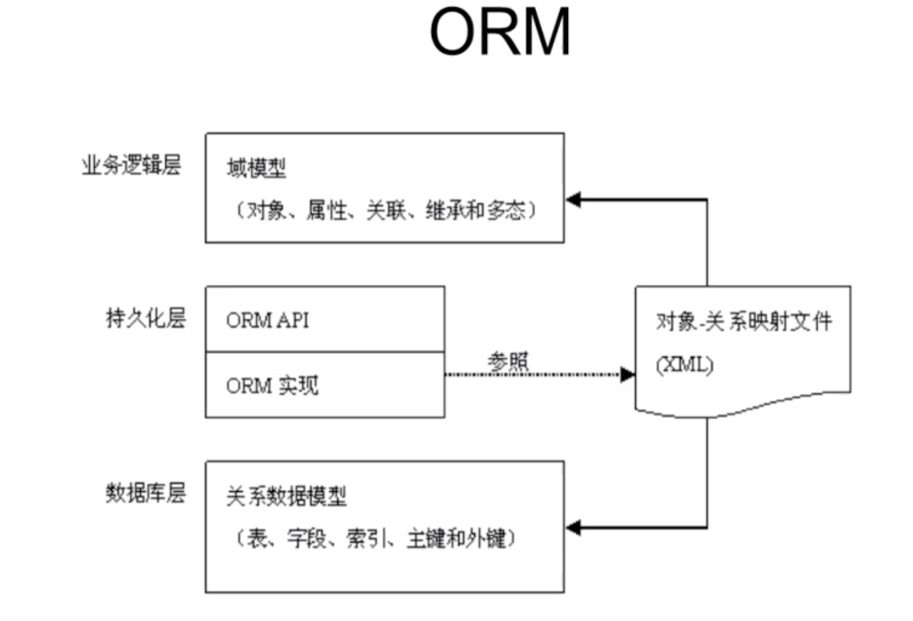

# Hibernate 学习笔记

[尚硅谷佟刚 Hibernate 框架全套教程](https://www.bilibili.com/video/BV1KW411u7GJ)

## 简介

Hibernate:
[http://hibernate.org/](http://hibernate.org/)

Hibernate 教程：
[https://www.w3cschool.cn/hibernate/](https://www.w3cschool.cn/hibernate/)

一个 Java 领域的持久化 ORM 框架

- 持久化：把对象永久保存到数据库中
- ORM： Object Relation Mapping 对象关系映射

ORM 主要解决对象-关系映射

| 面向对象 | 面向关系     |
| -------- | ------------ |
| 类       | 表           |
| 对象     | 表记录（行） |
| 属性     | 表字段（列） |

ORM 思想：

- 将关系数据库表中的记录映射称为对象，以对象的形式展现
- 把对数据库的操作转化为对对象的操作

ORM 采用元数据来描述对象-关系映射细节，元数据通常采用 XML 格式



流行的 ORM 框架

- Hibernate 采用面向对象的方式操作关系数据库
- MyBatis 灵活度高，运行速度快，开发速度慢
- TopLink
- OJB

eclipse 环境 Hibernatetools 插件

依赖

```
antlr
dom4j
hibernate-commons-annotations
hibernate-core
hibernate-jpa
javassist
jboss-logging
jboss-transaction-api
mysql-connector-java
```

## Hibernate 开发步骤

官网示例
https://docs.jboss.org/hibernate/orm/5.4/quickstart/html_single/

1. 创建 Hibrenate 配置文件
2. 创建持久化类
3. 创建对象-关系映射文件
4. 通过 Hibrenate API 编写访问数据库的代码

> 参考
> [IntelliJ IDEA 下自动生成 Hibernate 映射文件以及实体类](https://blog.csdn.net/qq_34197553/article/details/77718925)

保存数据步骤

```
1. 创建一个SessionFactory对象
2. 创建一个Session对象
3. 开始事务
4. 执行保存操作
5. 提交事务
6. 关闭Session对象
7. 关闭SessionFactory对象
```

代码示例

依赖
pom.xml

```xml
<?xml version="1.0" encoding="UTF-8"?>
<project xmlns="http://maven.apache.org/POM/4.0.0"
         xmlns:xsi="http://www.w3.org/2001/XMLSchema-instance"
         xsi:schemaLocation="http://maven.apache.org/POM/4.0.0 http://maven.apache.org/xsd/maven-4.0.0.xsd">
    <modelVersion>4.0.0</modelVersion>

    <groupId>com.mouday</groupId>
    <artifactId>hibernate-demo</artifactId>
    <version>1.0-SNAPSHOT</version>

    <build>
        <resources>
            <!--编译src/main/java目录下的xml文件-->
            <resource>
                <directory>src/main/java</directory>
                <includes>
                    <include>**/*.xml</include>
                </includes>
                <filtering>true</filtering>
            </resource>
        </resources>
    </build>

    <dependencies>
        <dependency>
            <groupId>mysql</groupId>
            <artifactId>mysql-connector-java</artifactId>
            <version>8.0.20</version>
        </dependency>

        <dependency>
            <groupId>org.hibernate</groupId>
            <artifactId>hibernate-core</artifactId>
            <version>5.4.10.Final</version>
        </dependency>

        <dependency>
            <groupId>junit</groupId>
            <artifactId>junit</artifactId>
            <version>4.11</version>
            <scope>test</scope>
        </dependency>
    </dependencies>

</project>
```

配置文件
src/main/resources/hibernate.cfg.xml

```xml
<?xml version='1.0' encoding='utf-8'?>
<!DOCTYPE hibernate-configuration PUBLIC
        "-//Hibernate/Hibernate Configuration DTD//EN"
        "http://www.hibernate.org/dtd/hibernate-configuration-3.0.dtd">

<hibernate-configuration>
    <session-factory>
        <!--配置数据库基本信息-->
        <property name="connection.url">jdbc:mysql://localhost:3306/data</property>
        <property name="connection.driver_class">com.mysql.cj.jdbc.Driver</property>
        <property name="connection.username">root</property>
        <property name="connection.password">123456</property>

        <!--配置Hibernate基本信息-->
        <!--数据库方言-->
        <property name="dialect">org.hibernate.dialect.MySQLDialect</property>

        <!--打印sql-->
        <property name="show_sql">true</property>

        <!--sql格式化-->
        <property name="format_sql">true</property>

        <!-- 自动生成数据表的策略 -->
        <property name="hibernate.hbm2ddl.auto">update</property>

        <!--关联映射文件-->
        <mapping resource="com/mouday/entity/Person.hbm.xml"/>
        <mapping class="com.mouday.entity.Person"/>

    </session-factory>
</hibernate-configuration>
```

建表语句

```sql
CREATE TABLE `person` (
  `id` int(11) NOT NULL AUTO_INCREMENT,
  `name` varchar(255)  DEFAULT '',
  `birth` date DEFAULT NULL,
  PRIMARY KEY (`id`)
) ENGINE=InnoDB DEFAULT CHARSET=utf8mb4 COLLATE=utf8mb4_general_ci COMMENT='人物'
```

映射文件
src/main/java/com/mouday/entity/Person.hbm.xml

```xml
<?xml version='1.0' encoding='utf-8'?>
<!DOCTYPE hibernate-mapping PUBLIC
    "-//Hibernate/Hibernate Mapping DTD 3.0//EN"
    "http://www.hibernate.org/dtd/hibernate-mapping-3.0.dtd">
<hibernate-mapping>

    <class name="com.mouday.entity.Person" table="person" schema="data">
        <id name="id">
            <column name="id" sql-type="int(11)"/>
            <!--指定主键生成方式为数据库底层生成方式-->
            <generator class="native"/>
        </id>
        <property name="name">
            <column name="name" sql-type="varchar(255)" not-null="true"/>
        </property>
        <property name="birth">
            <column name="birth" sql-type="date" not-null="true"/>
        </property>
    </class>
</hibernate-mapping>
```

实体类
src/main/java/com/mouday/entity/Person.java

```java
package com.mouday.entity;

import java.util.Date;

public class Person {
    private int id;
    private String name;
    private Date birth;

    public int getId() {
        return id;
    }

    public void setId(int id) {
        this.id = id;
    }

    public String getName() {
        return name;
    }

    public void setName(String name) {
        this.name = name;
    }

    public Date getBirth() {
        return birth;
    }

    public void setBirth(Date birth) {
        this.birth = birth;
    }

    @Override
    public String toString() {
        return "Person{" +
                "id=" + id +
                ", name='" + name + '\'' +
                ", birth=" + birth +
                '}';
    }
}

```

保存数据

src/test/java/com/mouday/PersonTest.java

```java
package com.mouday;

import com.mouday.entity.Person;
import org.hibernate.Session;
import org.hibernate.SessionFactory;
import org.hibernate.Transaction;
import org.hibernate.boot.MetadataSources;
import org.hibernate.boot.registry.StandardServiceRegistry;
import org.hibernate.boot.registry.StandardServiceRegistryBuilder;
import org.hibernate.cfg.Configuration;
import org.junit.Test;

import java.util.Date;

public class PersonTest {
    @Test
    public void testPerson() {
        // 1. 创建一个SessionFactory对象
        // 默认 "hibernate.cfg.xml"
        Configuration configuration = new Configuration().configure();
        SessionFactory sessionFactory = configuration.buildSessionFactory();

        // 官网示例
        // StandardServiceRegistry registry = new StandardServiceRegistryBuilder().configure().build();
        // SessionFactory sessionFactory = new MetadataSources(registry).buildMetadata().buildSessionFactory();

        // 2. 创建一个Session对象
        Session session = sessionFactory.openSession();

        // 3. 开始事务
        Transaction transaction = session.beginTransaction();

        // 4. 执行保存操作
        Person person = new Person();
        person.setName("Tom");
        person.setBirth(new Date());

        session.save(person);

        // 获取操作
        // Person person = session.get(Person.class, 1);
        // System.out.println(person);
        //Person{id=1, name='Tom', birth=2020-07-19}

        // 5. 提交事务
        transaction.commit();

        // 6. 关闭Session对象
        session.close();

        // 7. 关闭SessionFactory对象
        sessionFactory.close();
    }
}


```

## 持久化 Java 类

- 提供一个无参构造器
- 提供一个标识属性
- 为类的持久化字段声明方法
- 使用费 final 类
- 重写 equals 和 hashCode 方法

Hibenate 低侵入式设计：

Hibernate 持久化类不要求持久化类继承任何父类或实现接口，可以保证代码不被污染。

Configuration 配置管理
SessionFactory 一个应用只初始化一个
Session 单线程对象
Transaction 事务代表一次原子操作

配置参数

hbm2ddl.auto 可以实现正向工程
由 java 代码生成数据库脚本，生成具体的表结构

取值：

```
create 每次运行都会删除原表，生成新的表
create-drop 自动生成表，SessionFactory 一关闭就自动删除
update 会根据.hbm.xml 文件自动生成表，若结构不同，会自动更新数据表结构
但不会删除已有的行和列
validate：和数据库中的表进行比较，若列数据不存在则抛出异常
```

Session 提供了基本的保存，更新，删除和加载 Java 对象的方法
Session 缓存的四种状态：
持久化
临时
游离
删除

Session 缓存可以减少 Hibernate 应用程序访问数据库的频率

- flush 使数据库表中的记录和 Session 缓存中的对象状态保持一致，为了保持一致，可能会发送对应的 sql
- refresh 强制发送 select 语句
- clear 清理缓存

可设置事务隔离级别

2020.7.19
接下来学习第 6 集
