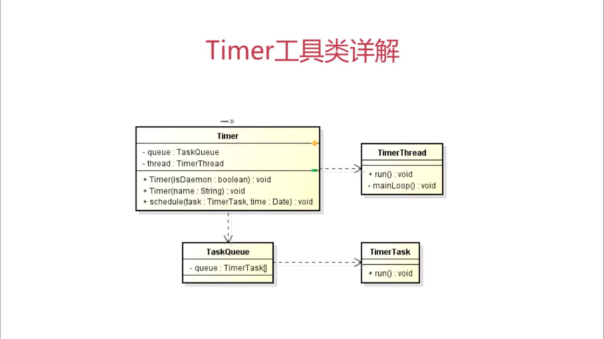

# Java 定时任务调度工具详解之 Timer

## 定时任务调度

定义：

基于给定的时间点，给定的时间间隔或者给定的执行次数自动执行的任务

Timer 和 Quartz

Timer： 有且仅有一个后台线程对多个业务线程进行定时定频率的调度

主要构件

```
Timer -定时调用-> TimerTask
```



## 定时函数的用法

```java
// 延时执行一次
public void schedule(TimerTask task, long delay)

// 定时执行一次
public void schedule(TimerTask task, Date time)

// 延时间隔执行
public void schedule(TimerTask task, long delay, long period)

// 定时间隔执行
public void schedule(TimerTask task, Date firstTime, long period)

// 延时间隔执行
public void scheduleAtFixedRate(TimerTask task, long delay, long period)

// 定时间隔执行
public void scheduleAtFixedRate(TimerTask task, Date firstTime, long period)
```

代码实例

```java
package timer;

import java.text.SimpleDateFormat;
import java.util.Calendar;
import java.util.Timer;
import java.util.TimerTask;

class Util {
    public static String getCurrentDateTime() {
        Calendar calendar = Calendar.getInstance();
        SimpleDateFormat dateFormat = new SimpleDateFormat("yyyy-MM-dd HH:mm:ss");
        return dateFormat.format(calendar.getTime());
    }
}

class MyTimerTask extends TimerTask {
    @Override
    public void run() {
        System.out.println("MyTimerTask is Running " + Util.getCurrentDateTime());
    }
}


public class TimerDemo {
    public static void main(String[] args) {
        Timer timer = new Timer();

        // 延时0s之后，每隔1s执行一次
        timer.schedule(new MyTimerTask(), 0L, 1000L);
    }
}
```

执行结果

```
MyTimerTask is Running 2020-06-22 22:49:45
MyTimerTask is Running 2020-06-22 22:49:46
MyTimerTask is Running 2020-06-22 22:49:47
...
```

## 其他函数

```
TimerTask.cancel() 取消【当前】 TimerTask 里的任务
TimerTask.scheduledExecutionTime() 返回此任务最近实际执行的已安排执行的时间

Timer.cancel()终止此计时器，丢弃【所有】当前已安排的任务
Timer.purge() 从此计时器的任务队列中移除所有已取消的任务，返回移除数量
```

## 区别

schedule 和 scheduleAtFixedRate

1、首次计划执行的时间早于当前的时间

schedule fixed-delay

如果第一次执行时间被 delay 了，随后的执行时间按照上一次实际执行【完成的时间点】进行计算

scheduleAtFixedRate fixed-rate

如果第一次执行时间被 delay 了，随后的执行时间按照上一次【开始的时间点】进行计算，并且为了赶上进度会多次执行任务，因此 TimerTask 中的执行体需要考虑同步

代码示例

```java
package timer;

import java.text.SimpleDateFormat;
import java.util.Calendar;
import java.util.Date;
import java.util.Timer;
import java.util.TimerTask;


public class TimerDemo {
    public static void main(String[] args) {
        Timer timer = new Timer();

        SimpleDateFormat dateFormat = new SimpleDateFormat("yyyy-MM-dd HH:mm:ss");

        Calendar calendar = Calendar.getInstance();
        calendar.add(Calendar.SECOND, -10);

        timer.schedule(new TimerTask() {
            @Override
            public void run() {
                System.out.println(dateFormat.format(new Date()));
            }
        }, calendar.getTime(), 2000L);
    }
}
```

执行结果

```
timer.schedule

2020-06-22 23:16:56
2020-06-22 23:16:58
2020-06-22 23:17:00


timer.scheduleAtFixedRate
2020-06-22 23:18:19
2020-06-22 23:18:19
2020-06-22 23:18:19
```

2、任务执行所需时间超出任务的执行周期间隔
schedule
下次执行时间相对于上一次实际执行【完成的时间点】，因此执行时间会不断延后

scheduleAtFixedRate
下一次执行时间相对于上一次【开始的时间点】，因此执行时间一般不会延后，因此存在并发性

```java
package timer;

import java.text.SimpleDateFormat;
import java.util.Date;
import java.util.Timer;
import java.util.TimerTask;


public class TimerDemo {
    public static void main(String[] args) {
        Timer timer = new Timer();

        SimpleDateFormat dateFormat = new SimpleDateFormat("yyyy-MM-dd HH:mm:ss");

        timer.scheduleAtFixedRate(new TimerTask() {
            @Override
            public void run() {
                try {
                    Thread.sleep(3000L);
                } catch (InterruptedException e) {
                    e.printStackTrace();
                }
                System.out.println(dateFormat.format(new Date()));
            }
        }, 0L, 1000L);


    }
}
```

```
timer.schedule

2020-06-22 23:24:08
2020-06-22 23:24:11
2020-06-22 23:24:14


timer.scheduleAtFixedRate
2020-06-22 23:25:18
2020-06-22 23:25:21
2020-06-22 23:25:24
```

## Timer 综合应用

执行 5 次任务，就停止定时器，并退出程序

```java
package timer;

import java.text.SimpleDateFormat;
import java.util.Date;
import java.util.Timer;
import java.util.TimerTask;

// 自定义任务
class MyTimerTask extends TimerTask {

    private SimpleDateFormat dateFormat = new SimpleDateFormat("yyyy-MM-dd HH:mm:ss");

    private int count = 0;

    private Timer timer;

    public MyTimerTask(Timer timer) {
        this.timer = timer;
    }

    @Override
    public void run() {
        System.out.println(dateFormat.format(new Date()));

        // 判断执行满5次就停止
        this.count++;

        if (this.count >= 5) {
            // 停止当前任务
            this.cancel();

            // 停止定时器，并退出程序
            this.timer.cancel();
        }
    }
}

public class TimerDemo {
    public static void main(String[] args) {
        Timer timer = new Timer();
        timer.schedule(new MyTimerTask(timer), 0L, 1000L);
    }
}
```

打印结果

```
2020-06-23 20:46:11
2020-06-23 20:46:12
2020-06-23 20:46:13
2020-06-23 20:46:14
2020-06-23 20:46:15
```

## Timer 缺陷

1、管理并发任务的缺陷
Timer 有且仅有一个线程去执行定时任务，如果存在多个任务，且任务时间过长，会导致执行效果与预期不符

2、当任务抛出异常时的缺陷
如果 TimerTask 抛出 RuntimeException，Timer 会停止所有任务的运行

3、以下场景不建议使用

1. 对时效性要求较高的多任务并发作业
2. 对复杂的任务的调度
