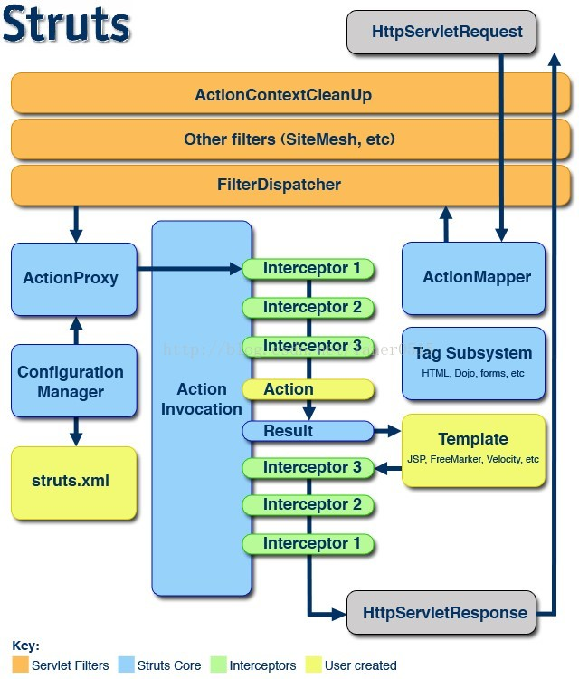

# Struts2

## 一、Struts2 概述

Struts 翻译：支柱

Struts 是流行和成熟的基于 MVC 设计模式的 Web 应用程序框架

POJO（Plain Ordinary Java Object）简单的 Java 对象

MVC 模式

模型视图控制器

Model View Controller

工作原理图



环境

## 二、Struts2 项目

项目结构

```
.
├── pom.xml
└── src
    ├── main
    │   ├── java
    │   │   └── com
    │   │       └── mouday
    │   │           └── HelloWorldAction.java
    │   ├── resources
    │   │   └── struts.xml
    │   └── webapp
    │       ├── WEB-INF
    │       │   └── web.xml
    │       ├── hello.jsp
    │       └── index.html
    └── test
        └── java

```

1、配置文件

（1）pom.xml

```xml
<?xml version="1.0" encoding="UTF-8"?>
<project xmlns="http://maven.apache.org/POM/4.0.0"
         xmlns:xsi="http://www.w3.org/2001/XMLSchema-instance"
         xsi:schemaLocation="http://maven.apache.org/POM/4.0.0 http://maven.apache.org/xsd/maven-4.0.0.xsd">
    <modelVersion>4.0.0</modelVersion>

    <groupId>org.example</groupId>
    <artifactId>java-demo-struts</artifactId>
    <version>1.0-SNAPSHOT</version>

    <build>

        <plugins>
            <!-- tomcat7插件 maven 命令 tomcat7:run 启动项目-->
            <plugin>
                <groupId>org.apache.tomcat.maven</groupId>
                <artifactId>tomcat7-maven-plugin</artifactId>
                <version>2.2</version>
                <configuration>
                    <port>8080</port>
                    <path>/</path>
                    <uriEncoding>UTF-8</uriEncoding>
                    <!--添加忽略war包检查标签，则可以让tomcat7：run指令正常启动tomcat-->
                    <ignorePackaging>true</ignorePackaging>
                    <contextFile>src/main/webapp/WEB-INF/web.xml</contextFile>
                    <contextReloadable>true</contextReloadable>
                </configuration>
            </plugin>

        </plugins>
    </build>

    <!-- https://mvnrepository.com/artifact/org.apache.struts/struts2-core -->
    <dependencies>
        <dependency>
            <groupId>org.apache.struts</groupId>
            <artifactId>struts2-core</artifactId>
            <version>2.5.22</version>
        </dependency>

        <!-- https://mvnrepository.com/artifact/javax.servlet/javax.servlet-api -->
        <dependency>
            <groupId>javax.servlet</groupId>
            <artifactId>javax.servlet-api</artifactId>
            <version>4.0.1</version>
            <scope>provided</scope>
        </dependency>

    </dependencies>

</project>
```

（2）src/main/webapp/WEB-INF/web.xml

```xml
<?xml version="1.0" encoding="utf-8" ?>

<web-app>
    <display-name>Hello</display-name>

    <filter>
        <filter-name>struts2</filter-name>
        <filter-class>org.apache.struts2.dispatcher.filter.StrutsPrepareAndExecuteFilter</filter-class>
    </filter>

    <filter-mapping>
        <filter-name>struts2</filter-name>
        <url-pattern>/*</url-pattern>
    </filter-mapping>

    <welcome-file-list>
        <welcome-file>index.html</welcome-file>
    </welcome-file-list>
</web-app>
```

（3）src/main/resources/struts.xml

```xml
<?xml version="1.0" encoding="utf-8" ?>

<!DOCTYPE struts PUBLIC
        "-//Apache Software Foundation//DTD Struts Configuration 2.5//EN"
        "http://struts.apache.org/dtds/struts-2.5.dtd">
<struts>
    <package name="default" namespace="/" extends="struts-default">
        <action name="HelloWorldAction" class="com.mouday.HelloWorldAction">
            <result name="">/hello.jsp</result>
        </action>
    </package>
</struts>
```

2、Action

src/main/java/com/mouday/HelloWorldAction.java

```java
package com.mouday;

import com.opensymphony.xwork2.ActionSupport;

public class HelloWorldAction extends ActionSupport {
    @Override
    public String execute() throws Exception {
        System.out.println("hello action");
        return SUCCESS;
    }
}

```

3、视图文件

src/main/webapp/index.html

```html
<!DOCTYPE html>
<html lang="en">
  <body>
    hi
  </body>
</html>
```

src/main/webapp/hello.jsp

```jsp
<!DOCTYPE html>
<html lang="en">

<body>
hello action jsp
</body>
</html>
```

4、访问测试

```
GET http://localhost:8080/

hi


GET http://localhost:8080/HelloWorldAction

hello action jsp
```

## 三、核心文件

```
web.xml
struts.xml
struts.properties 全局属性文件，自动加载
```

struts.properties 常用配置

```bash
# struts.xml改动后重新加载重载 默认 false
struts.configuration.xml.reload=true

# 打开开发模式 默认 false
struts.devMode=true

# 设置浏览器缓存静态页面 默认true
struts.serve.static.browserCache=false

# 被struts处理的请求后缀
struts.action.extension=action,do

# 服务器运行时端口号
struts.url.http.port=8080
```

## 四、深入 Struts2

1、访问 Servlet API 方式

1. ActionContext
2. 实现 Aware 接口
3. ServletActionContext

2、Action 搜索顺序
逐级向上查找

3、动态方法调用
（1）指定 method 属性

```java
package com.mouday;

import com.opensymphony.xwork2.ActionSupport;

public class HelloWorldAction extends ActionSupport {
    @Override
    public String execute() throws Exception {
        System.out.println("hello action");
        return SUCCESS;
    }

    public String add(){
        System.out.println("add");
        return SUCCESS;
    }
}

```

struts.xml(简化)

```xml
<struts>
    <package name="default" namespace="/" extends="struts-default">
        <action name="add" class="com.mouday.HelloWorldAction" method="add">
            <result name="">/add.jsp</result>
        </action>
    </package>
</struts>
```

访问结果

```
GET http://localhost:8080/add.action

add result
```

（2）感叹号方式（不推荐）

> 参考
> [struts2.5 使用感叹号和通配符实现动态方法调用无效的问题及解决！](https://www.cnblogs.com/tieway59/p/10996124.html)

配置文件

```xml
<?xml version="1.0" encoding="utf-8" ?>


<!DOCTYPE struts PUBLIC
        "-//Apache Software Foundation//DTD Struts Configuration 2.5//EN"
        "http://struts.apache.org/dtds/struts-2.5.dtd">

<struts>
    <package name="default" namespace="/" extends="struts-default">
        <global-allowed-methods>regex:.*</global-allowed-methods>

        <action name="HelloWorldAction" class="com.mouday.HelloWorldAction">
            <result>/hello.jsp</result>
            <result name="add">/add.jsp</result>
        </action>
    </package>

    <constant name="struts.enable.DynamicMethodInvocation" value="true"/>
</struts>
```

```
GET http://localhost:8080/HelloWorldAction!add.action

add result
```

（3） 通配符方式

```xml
<?xml version="1.0" encoding="utf-8" ?>

<!DOCTYPE struts PUBLIC
        "-//Apache Software Foundation//DTD Struts Configuration 2.5//EN"
        "http://struts.apache.org/dtds/struts-2.5.dtd">

<struts>

    <package name="default" namespace="/" extends="struts-default">
        <global-allowed-methods>regex:.*</global-allowed-methods>

        <action name="*_*" method="{2}" class="com.mouday.{1}Action">
            <result name="{2}">/{2}.jsp</result>
        </action>
    </package>

    <constant name="struts.enable.DynamicMethodInvocation" value="true"/>
</struts>
```

```
GET http://localhost:8080/HelloWorldAction_add.action

add result
```

4、指定多个配置文件

```xml
<include file="helloworld.xml" />
```

配置示例

struts.xml

```xml
<?xml version="1.0" encoding="utf-8" ?>


<!DOCTYPE struts PUBLIC
        "-//Apache Software Foundation//DTD Struts Configuration 2.5//EN"
        "http://struts.apache.org/dtds/struts-2.5.dtd">

<struts>
    <include file="hello.xml"/>

    <constant name="struts.enable.DynamicMethodInvocation" value="true"/>

    <!-- 以防乱码-->
    <constant name="struts.i18n.encoding" value="UTF-8"/>
</struts>
```

hello.xml

```xml
<?xml version="1.0" encoding="utf-8" ?>

<!DOCTYPE struts PUBLIC
        "-//Apache Software Foundation//DTD Struts Configuration 2.5//EN"
        "http://struts.apache.org/dtds/struts-2.5.dtd">

<struts>

    <package name="default" namespace="/" extends="struts-default">
        <global-allowed-methods>regex:.*</global-allowed-methods>

        <action name="*_*" method="{2}" class="com.mouday.{1}Action">
            <result name="{2}">/{2}.jsp</result>
        </action>
    </package>

</struts>

```

访问

```
GET http://localhost:8080/HelloWorld_add.action

add result
```

5、默认 Action

```xml
<?xml version="1.0" encoding="utf-8" ?>

<!DOCTYPE struts PUBLIC
        "-//Apache Software Foundation//DTD Struts Configuration 2.5//EN"
        "http://struts.apache.org/dtds/struts-2.5.dtd">

<struts>
    <package name="default" namespace="/" extends="struts-default">

        <default-action-ref name="index" />

        <action name="index">
            <result>/error.jsp</result>
        </action>

    </package>
</struts>
```

访问

```
GET http://localhost:8080/xxxx.action

error jsp
```

6、Struts2 后缀
（1）struts.xml

```xml
<constant name="struts.action.extension" value="html" />
```

（2）struts.properties

```
struts.action.extension=action,do
```

（3）web.xml

```xml
 <filter>
    <filter-name>struts2</filter-name>
    <filter-class>org.apache.struts2.dispatcher.filter.StrutsPrepareAndExecuteFilter</filter-class>
    <init-param>
        <param-name>struts.action.extension</param-name>
        <param-value>do</param-value>
    </init-param>
</filter>
```

7、接收参数

（1）Action 属性

Action 类

```java
package com.mouday;

import com.opensymphony.xwork2.ActionSupport;

public class LoginAction extends ActionSupport {
    private String username;

    public String getUsername() {
        return username;
    }

    public void setUsername(String username) {
        this.username = username;
    }

    @Override
    public String execute() throws Exception {
        System.out.println(username);
        return SUCCESS;
    }
}

```

路由配置

```xml
<action name="login" class="com.mouday.LoginAction">
    <result>/login.html</result>
</action>
```

表单页面

```html
<form action="login.action" method="post">
  <input type="text" name="username" />
  <input type="submit" />
</form>
```

（2）Domain Model

新建 User 类

```java
package com.mouday.bean;

public class User {
    private String username;

    public String getUsername() {
        return username;
    }

    public void setUsername(String username) {
        this.username = username;
    }
}

```

Action

```java
package com.mouday.action;

import com.mouday.bean.User;
import com.opensymphony.xwork2.ActionSupport;

public class LoginAction extends ActionSupport {
    private User user;

    public User getUser() {
        return user;
    }

    public void setUser(User user) {
        this.user = user;
    }

    @Override
    public String execute() throws Exception {
        System.out.println(user.getUsername());
        return SUCCESS;
    }
}

```

登录表单

```html
<form action="login.action" method="post">
  <input type="text" name="user.username" />
  <input type="submit" />
</form>
```

（3）ModelDriven

Action

```java
package com.mouday.action;

import com.mouday.bean.User;
import com.opensymphony.xwork2.ActionSupport;
import com.opensymphony.xwork2.ModelDriven;

public class LoginAction extends ActionSupport implements ModelDriven<User> {
    private User user = new User();

    @Override
    public String execute() throws Exception {
        System.out.println(user.getUsername());
        return SUCCESS;
    }

    public User getModel() {
        return user;
    }
}

```

表单

```html
<form action="login.action" method="post">
  <input type="text" name="username" />
  <input type="submit" />
</form>
```

（4）接收列表类型

User 类

```java
package com.mouday.bean;

import java.util.List;

public class User {
    private String username;
    private List<String> list;

    public List<String> getList() {
        return list;
    }

    public void setList(List<String> list) {
        this.list = list;
    }

    public String getUsername() {
        return username;
    }

    public void setUsername(String username) {
        this.username = username;
    }
}

```

Action

```java
package com.mouday.action;

import com.mouday.bean.User;
import com.opensymphony.xwork2.ActionSupport;
import com.opensymphony.xwork2.ModelDriven;

public class LoginAction extends ActionSupport implements ModelDriven<User> {
    private User user = new User();

    @Override
    public String execute() throws Exception {
        System.out.println(user.getUsername());
        System.out.println(user.getList());
        return SUCCESS;
    }

    public User getModel() {
        return user;
    }
}

```

表单

```html
<form action="login.action" method="post">
  <input type="text" name="username" />
  <input type="text" name="list[0]" />
  <input type="text" name="list[1]" />
  <input type="submit" />
</form>
```

8、处理结果类型
Struts2 处理流程

```
用户请求
-> Stuts框架
-> 控制器Action
-> Stuts框架
-> 视图资源
```

result 如果省略 name，则默认是 success

```xml
<result name="success">/success.jsp</result>

<!-- 等价于 -->
<result>/success.jsp</result>
```

处理结果类型：

1. SUCCESS 正确执行，默认视图
2. NONE 正确执行，不返回视图
3. ERROR 执行失败
4. LOGIN 登录视图
5. INPUT 参数输入界面

Action

```java
package com.mouday.action;

import com.mouday.bean.User;
import com.opensymphony.xwork2.ActionSupport;
import com.opensymphony.xwork2.ModelDriven;

public class LoginAction extends ActionSupport implements ModelDriven<User> {
    private User user = new User();

    @Override
    public String execute() throws Exception {
        System.out.println(user.getUsername());
        System.out.println(user.getList());
        return SUCCESS;
    }

    @Override
    public void validate() {
        if (user.getUsername() == null || "".equals(user.getUsername())
        ) {
            addFieldError("username", "用户名不能为空");
        }
    }

    public User getModel() {
        return user;
    }
}

```

配置

```xml
<?xml version="1.0" encoding="utf-8" ?>


<!DOCTYPE struts PUBLIC
        "-//Apache Software Foundation//DTD Struts Configuration 2.5//EN"
        "http://struts.apache.org/dtds/struts-2.5.dtd">

<struts>
    <package name="default" namespace="/" extends="struts-default">

        <action name="login" class="com.mouday.action.LoginAction">
            <result>/login.jsp</result>
            <result name="input">/login.jsp</result>
        </action>

    </package>

</struts>
```

登录框

```jsp
<%@ page language="java" contentType="text/html; charset=UTF-8" pageEncoding="UTF-8"%>
<%@  taglib  prefix="s"  uri="/struts-tags"  %>

<form action="login.action" method="post">
    <input type="text" name="username"/>
    <!-- 显示错误提示 -->
    <s:fielderror name="username"></s:fielderror>

    <input type="text" name="list[0]"/>
    <input type="text" name="list[1]"/>
    <input type="submit" />
</form>

```

9、局部结果和全局结果
OGNL

```xml
<result name="">
    <param name="location">resource</param>
</result>
```
