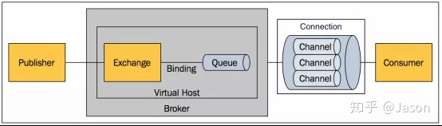
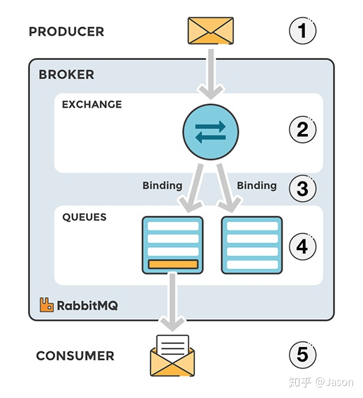

# 第十章-SpringBoot 与消息

## JMS&AMQP 简介

消息服务中间件可以提升系统异步通信，扩展解耦能力

两个重要概念：

- 消息代理 message broker
- 目的地 destination
  - 队列 queue ：
    - 点对点消息通信 point-to-point
    - 唯一的发送者和接收者
  - 主体 topic
    - 发布 publish/订阅 subscribe 消息通信
    - 多接收者

| 协议         | JMS                       | AMQP                              |
| ------------ | ------------------------- | --------------------------------- |
| 英文         | Java Message Service Java | Advanced Message Queuing Protocol |
| 中文         | 消息服务                  | 高级消息队列协议                  |
| 实现         | ActiveMQ、HornetMQ        | RabbitMQ                          |
| 定义         | JAVA API                  | 网络线级协议                      |
| 跨语言       | 否                        | 是                                |
| 跨平台       | 否                        | 是                                |
| 消息模型     | peer-2-peer、Pub/Sub      | 5 种                              |
| 支持消息类型 | 多消息类型                | byte[]                            |
| 支持         | spring-jms                | spring-rabbit                     |
| 发送消息     | @JmsTemplate              | @RabbitTemplate                   |
| 监听消息     | @JmsListener              | @RabbitListener                   |
| 开启支持     | @EnableJms                | @EnableRabbit                     |
| 自动配置     | JmsAutoConfiguration      | RabbitAutoConfiguration           |

## RabbitMQ 基本概念简介

https://www.rabbitmq.com/

RabbitMQ 是由 erlang 开发的 AMQP（Advanced Message Queuing Protocol） 实现

核心概念

- Message 消息（消息头+消息体）
- Publisher 消息发布者
- Exchange 交换器 4 种类型
  - direct(默认)
  - fanout
  - topic
  - headers
- Queue 消息队列
- Binding 绑定
- Connection 网络连接
- Channel 信道
- Consumer 消费者
- Virtual Host 虚拟主机 默认/
- Broker 消息队列服务器实体



## RabbitMQ 运行机制

生产者把消息发布到 Exchange 上，
消息最终达到队列并被消费者接收，
而 Binding 决定交换器的消息应该发送到哪个队列



## RabbitMQ 安装测试

安装启动 RabbitMQ

```bash
# 安装带有管理界面
docker pull rabbitmq:management

# 客户端：5672 管理界面：15672
docker run -d -p 5672:5672 -p 15672:15672  --name myrabbitmq rabbitmq:management
```

管理界面
http://localhost:15672/

账号:guest
密码:guest

## RabbitTemplate 发送接受消息&序列化机制

引入依赖

```xml
<dependency>
    <groupId>org.springframework.boot</groupId>
    <artifactId>spring-boot-starter-amqp</artifactId>
</dependency>
```

自动配置类：RabbitAutoConfiguration
配置：RabbitProperties
给 Rabbit 发送和接收消息：RabbitTemplate
系统管理组件：AmqpAdmin

RabbitMQ 中新建：

```
queue: message
exchange: exchange.message
Routing key : message
```

自定义对象序列化规则

```java
package com.example.demo.config;

import org.springframework.amqp.support.converter.Jackson2JsonMessageConverter;
import org.springframework.amqp.support.converter.MessageConverter;
import org.springframework.context.annotation.Bean;
import org.springframework.context.annotation.Configuration;

@Configuration
public class MyAMQPConfig {

    // 以json的方式序列化对象
    @Bean
    public MessageConverter messageConverter(){
        return new Jackson2JsonMessageConverter();
    }
}

```

点对点发送消息测试

```java
package com.example.demo;


import org.junit.jupiter.api.Test;
import org.springframework.amqp.rabbit.core.RabbitTemplate;
import org.springframework.beans.factory.annotation.Autowired;
import org.springframework.boot.test.context.SpringBootTest;

import java.util.HashMap;
import java.util.Map;

@SpringBootTest
public class RabbitMQTest {
    @Autowired
    private RabbitTemplate rabbitTemplate;

    // 单播：发送数据
    @Test
    public void testSendRabbitMQ() {
        Map<String, Object> map = new HashMap<>();
        map.put("name", "Tom");
        map.put("age", 23);

        rabbitTemplate.convertAndSend("exchange.message", "message", map);
    }

    // 单播：接收数据
    @Test
    public void testReceiveRabbitMQ() {
        Object obj = rabbitTemplate.receiveAndConvert("message");
        System.out.println(obj);
        // {name=Tom, age=23}
    }
}

```

## @RabbitListener&@EnableRabbit

开启 RabbitMQ

```java
package com.example.demo;

import org.springframework.amqp.rabbit.annotation.EnableRabbit;
import org.springframework.boot.SpringApplication;
import org.springframework.boot.autoconfigure.SpringBootApplication;


@SpringBootApplication
@EnableRabbit
public class DemoApplication {

    public static void main(String[] args) {
        SpringApplication.run(DemoApplication.class, args);
    }

}

```

监听队列数据

```java
package com.example.demo.service;

import org.springframework.amqp.core.Message;
import org.springframework.amqp.rabbit.annotation.RabbitListener;
import org.springframework.stereotype.Service;

import java.util.Map;

@Service
public class MessageService {
    // 接收消息数据
    @RabbitListener(queues={"message"})
    public void listenMessage(Map<String, Object> map){
        System.out.println("收到消息: " + map);
    }

    // 接收消息头和消息体
    @RabbitListener(queues={"message"})
    public void receiveMessage(Message message){
        System.out.println("收到消息: " + message.getMessageProperties());
        System.out.println("收到消息: " + message.getBody());
    }
}

```

## AmqpAdmin 管理组件的使用

使用示例

```java
package com.example.demo;


import org.junit.jupiter.api.Test;
import org.springframework.amqp.core.AmqpAdmin;
import org.springframework.amqp.core.Binding;
import org.springframework.amqp.core.DirectExchange;
import org.springframework.amqp.core.Queue;
import org.springframework.amqp.rabbit.core.RabbitTemplate;
import org.springframework.beans.factory.annotation.Autowired;
import org.springframework.boot.test.context.SpringBootTest;

import java.util.HashMap;
import java.util.Map;

@SpringBootTest
public class RabbitMQTest {

    @Autowired
    AmqpAdmin amqpAdmin;

    @Test
    public void createExchange(){
        // 创建交换器
        amqpAdmin.declareExchange(new DirectExchange("exchange.admin"));

        // 创建queque
        amqpAdmin.declareQueue(new Queue("queue.admin"));

        // 创建绑定规则
        amqpAdmin.declareBinding(new Binding("queue.admin", Binding.DestinationType.QUEUE, "exchange.admin", "admin", null));

        System.out.println("创建成功");
    }
}

```
