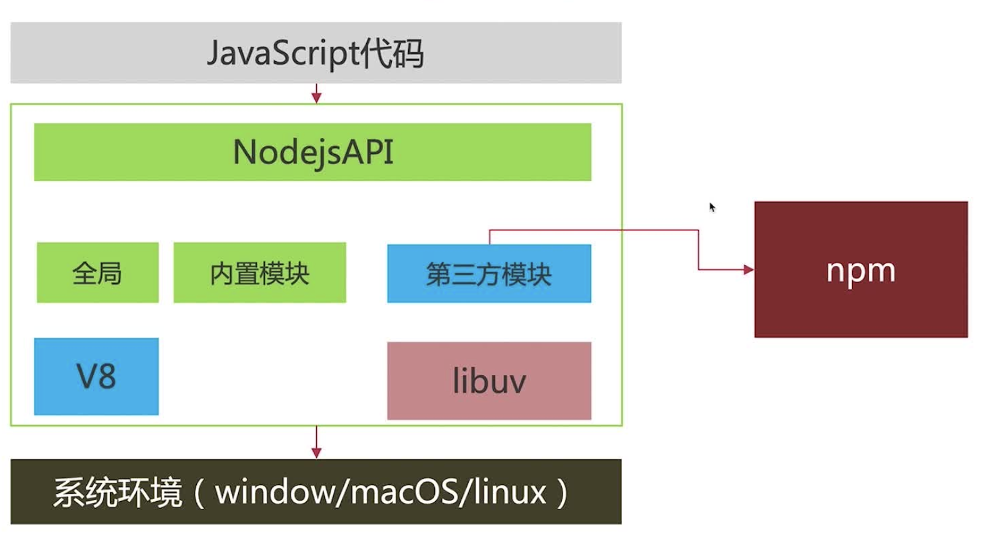

# React+Nodejs+MySQL全栈开发入门

## 内容介绍
1、开发环境准备
1. 安装Nodejs
2. 第一个Nodejs程序
3. Nodejs和npm
4. nodemon实现热启动
5. 使用nrm解决npm源的
6. 使用nvm管理Nodejs版本

2、Web应用基础
1. Web应用以及Express
2. 使用Express搭建第一个Web服务
3. 路由（Routing）的介绍和使用
4. 中间件（Middleware）介绍和使用
5. 自定义编写中间件
6. 异常处理
7. MySQL的安装和基本命令使用
8. ORM框架Sequelize介绍和使用

3、项目实战TODO

4、梳理总结

## 1、开发环境准备
1、安装Nodejs
1. 直接下载官方安装包
2. MacOS 使用Homebrew安装
3. 使用nvm版本管理器安装(推荐)

2、第一个Nodejs程序
创建项目配置文件
```
npm init -y
```

示例：读取CPU信息
```js
// 读取系统信息
const os = require('os')

// 读取cup数量
let cpus = os.cpus().length;
console.log(cpus);
// 8

// 获取内存信息
let tatol = os.totalmem(); // bytes
console.log(tatol/1024/1024/1024);  // GB

// 剩余内存
let free = os.freemem(); // bytes
console.log(free/1024/1024/1024);  // GB

```

示例：web服务
```js
const http = require('http');

const server = http.createServer((req, res)=>{
    res.end('hello')
})

server.listen(8080, ()=>{
    console.log("服务启动");
})

// http://localhost:8080/
```

3、Nodejs和npm
```
JavaScript代码
    ->
NodejsAPI
全局 内置模块 第三方模块(npm)
V8 libuv
    ->
系统环境（windows/macOS/linux）
```


4、nodemon实现热启动
项目结构
```
package.json
src/
    app.js
```

（1）安装nodemon
```
npm install nodemon -D
```

（2）修改package.json启动命令
```json
"scripts": {
    "start": "DEBUG=* nodemon src/app.js",
    "start:node": "node src/app.js"
}

```
`DEBUG=*`可选，打印debug信息

（3）指定监听文件nodemon.json
```json
{
    "watch": ["./src/**/*.js"]
}
```

5、使用nrm管理npm源
安装
```
npm install nrm -g

# 使用
nrm ls
nrm -h
```

6、使用nvm管理Nodejs版本
```
nvm ls
```

小结
nvm 管理Nodejs版本
npm 管理第三方包
nrm npm源管理
nodemon 监听文件，自动重启服务

## 2、Web应用基础
1、Web应用以及Express
```
前端 -> ajax, ws -> 服务器(web应用) -> 缓存/数据库
```

express 接收 request， 处理response
一种web框架
https://expressjs.com/

2、使用Express搭建第一个Web服务
```
mkdir demo
cd demo
npm init -y
git init
echo node_modules > .gitignore
npm install express -S
npm install nodemon -D
```

项目结构
```
package.json
src/
    app.js
.gitignore
node_modules/
```

修改package.json
```json
"scripts": {
    "start": "nodemon ./src/app.js"
  },
```

app.js
```js
const express = require('express')

// 实例化
const app = express()

app.get('/', (request, response) => {
    response.json({
        name: "Tom",
        age: 21
    })
})

app.listen(8080, () => {
    console.log(`server start http://localhost:8080`);
})

```
启动服务
```
npm start
```
http://localhost:8080


3、路由（Routing）的介绍和使用
```
url -> 网络 -> dns解析 -> 目标服务器
```
路由规则

请求方法
get/post -> 响应
uri -> 路径

get/post/put/delete
```js
// callback = (req, res)=>{}
app.get(path, callback)
app.post(path, callback)

// 响应所有请求方式
app.all(path, callback)

// 响应所有请求uri
app.all("*", callback)

// 任何请求来了都会经过
app.use(path, callback)

// 路由拆分
```

路由拆分
app.js
```js
const express = require('express')
const dogRouter = require('./dog.router')
const catRouter = require('./cat.router')

// 实例化
const app = express()

// 注册路由
app.use('/dog', dogRouter)
app.use('/cat', catRouter)

app.listen(8080, () => {
    console.log(`server start http://localhost:8080`);
})

```

cat.router.js
```js
const express = require('express');

const router = express.Router();

router.get("/", (req, res)=>{
    res.end("cat")
})

module.exports = router;
```

dog.router.js
```js
const express = require('express');

const router = express.Router();

router.get("/", (req, res)=>{
    res.end("dog")
})

module.exports = router;
```

4、中间件（Middleware）介绍和使用
```
function(err, req, res, next)
// err 异常
// next 转交控制权
// 响应请求 结束响应
```
使用：
（1）app级别
最顶层注册
app.use()
```js

// 实例化
const app = express()

// 定义中间件
function logMiddleware(req, res, next){
    console.log("请求来了");
    next()
}

// 使用中间件
app.use(logMiddleware)

// 使用静态文件中间件
app.use(express.static('static'))

```

（2）router内部使用
```js
app.get("/", [Middleware], (req, res)=>{

})
```

（3）异常处理
异常捕获,放在最后处理
内置异常处理
```js

// 实例化
const app = express()

app.get("/", (req, res)=>{
    res.end(message)
})

// 异常处理中间件放在最后
function errHandlerMiddleware(err, req, res, next){
    if(err){
        res.json({
            msg: err.message
        })
    }
}

app.use(errHandlerMiddleware)

```

404异常
```js
function notFoundHandler(err, req, res, next) {
    res.json({
        msg: '接口不存在'
    })
}

app.use(notFoundHandler)

```

7、MySQL的安装和基本命令使用
查看本机brew服务
```
brew services list
brew services start/stop mysql
```
mysql
结构化数据库
提供数据存放的服务
数据库 划分存储区域
表 对象数组
app -> orm -> mysql驱动 -> mysql

8、ORM框架Sequelize介绍和使用
https://sequelize.org/v5/manual/getting-started.html

```
npm install sequelize -S
npm install sequelize-cli -D
npx sequelize-cli init
```

## 项目实战
1、需求说明
1. 查询全部数据：名称状态，分页
2. 新增任务：名称，截止日期，内容
3. 编辑
4. 删除
5. 修改状态：代办，完成

2、代码实现
所有异常 status=500
body-parse

3、数据库初始化
（1）初始化项目数库配置
sequelize cli
npx sequelize init


（2）生成模型文件
migrate/model
npx sequelize model:generate --name Todo --attributes name:string,deadline:date,content:string
（3）持久化，在数据库中生成模型对应的数据表
npx sequelize db:migrate

项目发布和运维介绍
pm2

## 重点回顾
1、技术栈
node http， 异常
web框架 express hapi koa egg
参数校验
mysql 
ORM sequelize

2、技术关键点
api： web webserver router handler orm db

3、注意事项
模型设计 模型之间关系
api文档 
测试


