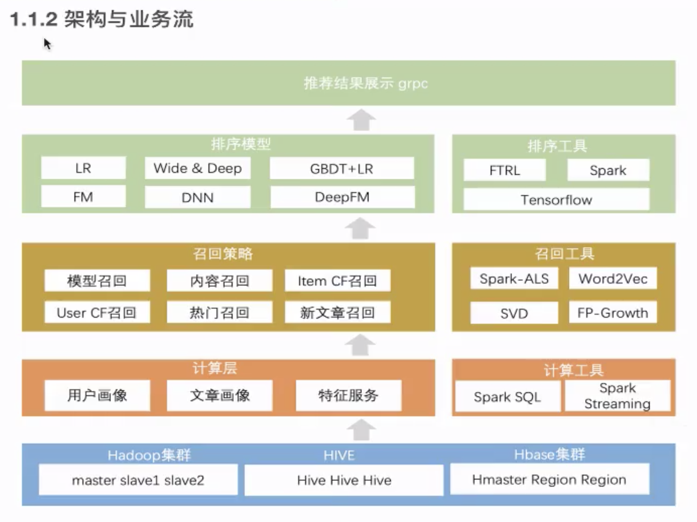

简介：

海量文章与海量用户，使用 lambda 大数据实时和离线计算，利用用户点击行为、浏览行为、收藏行为建立用户与文章之间的画像关系，通过机器学习推荐算法进行智能推荐，增加热门文章和新文章推荐占比，达到千人千面的推荐效果

使用推荐场景：

1. 首页频道推荐
2. 文章相似结果

基础数据层
数据处理层
推荐业务层

业务流：

1. 用户行为收集，业务数据收集
2. 批量计算（离线计算），用户文章画像，
3. 用户的召回结果，排序精选过程
4. grpc 的实时推荐业务流程
5. 缓存

环境配置

单机版环境
分布式环境

pip install -r requirements.txt --ignore-installed
