《推荐系统从入门到实战》学习笔记
https://www.bilibili.com/video/av200358253

## 推荐系统定义

推荐系统
定义：根据用户的历史信息和行为，向用户推荐他感兴趣的内容

基于行为的协同过滤
基于内容的相似推荐

推荐系统解决的问题

1. 信息过载
2. 挖掘长尾
3. 用户体验

## 推荐系统环节

低延迟 50ms\~300ms

推荐系统环节：

```
      输入 -> 召回 -> 排序 -> 调整 -> 输出
数据量 百万     万             千     百
```

1. 召回：

- 协同过滤召回
- 内容相似召回
- 图算法召回
- 热门召回
- 新课召回
  ...

2. 排序

- 机器学习-二分类算法
  - LR
  - GBDT
  - DNN
  - Wide&Deep

3. 调整

- 去重
- 已购/已读过滤
- 在线过滤
- 热门补足
- 分页提取
- 合并内容信息

## 推荐系统召回路径

i2i u2i u2i2i u2u2i u2tag2i

## Netflix 经典推荐系统架构

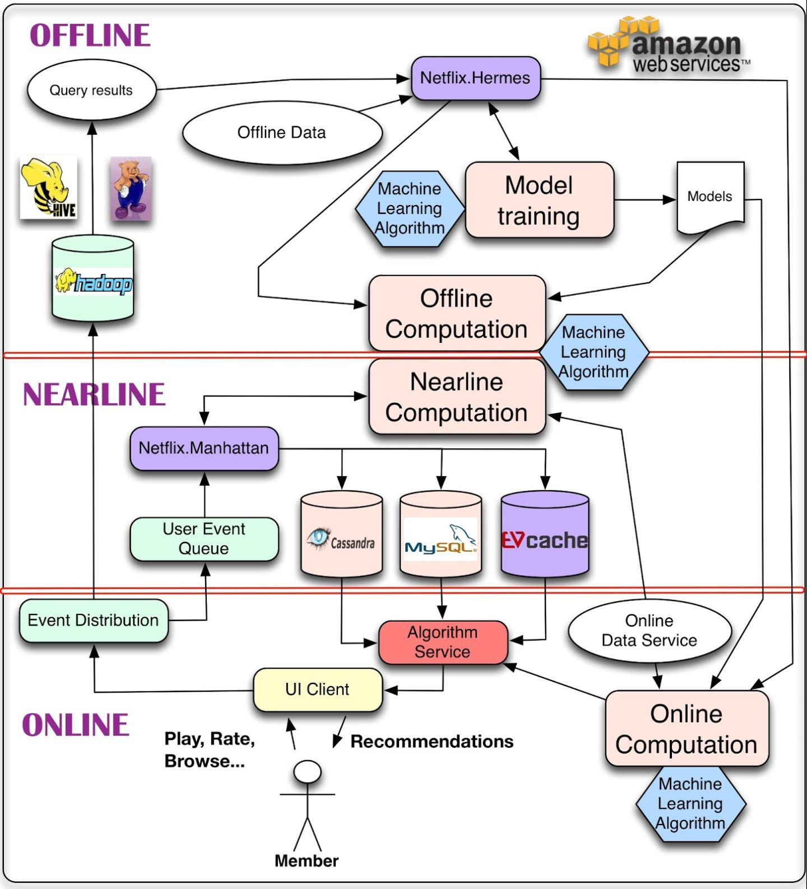

既能够处理海量数据，又能及时响应用户交互

1. 在线层 200ms
2. 近线层 10s
3. 离线层 天粒度

## 推荐系统技术架构

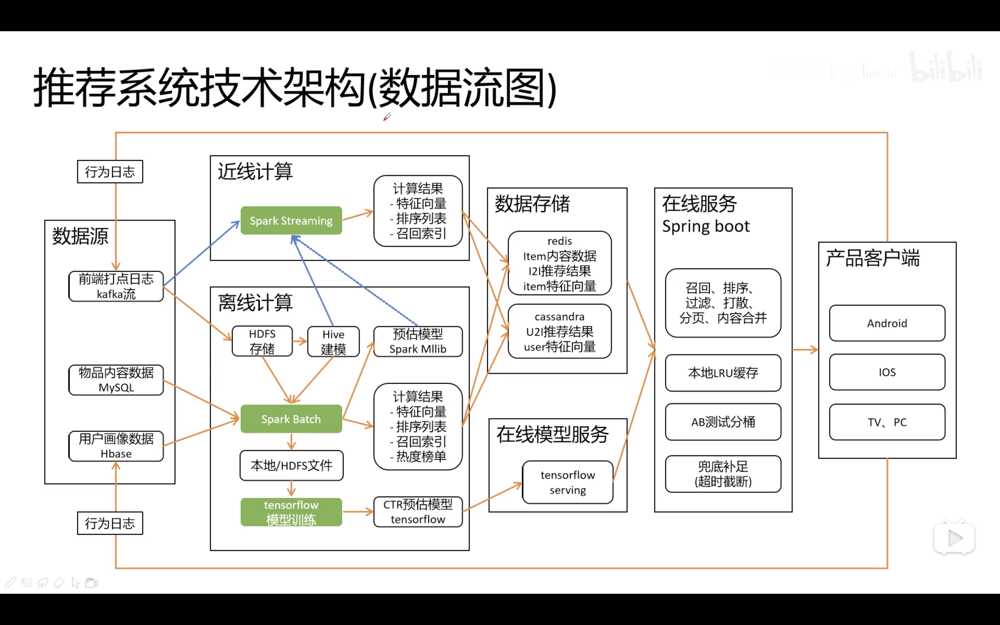

## 基于内容的推荐系统

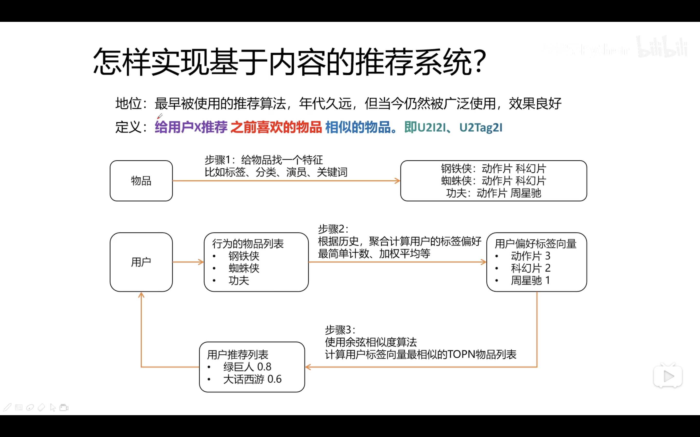

## 基于协同过滤的推荐系统

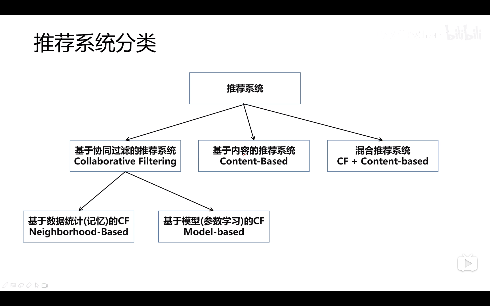

集体智慧

- 基于用户的协同过滤
- 基于物品的协同过滤

相似度计算方法

- Jaccard 相似度
- 余弦相似度
- 皮尔逊相关系数

## 多路召回融合排序

TopN

融合方法

- 按顺序展示
- 平均法
- 加权平均
- 动态加权法
- 机器学习权重法

## AB 测试

数据驱动

## 实现内容相似推荐

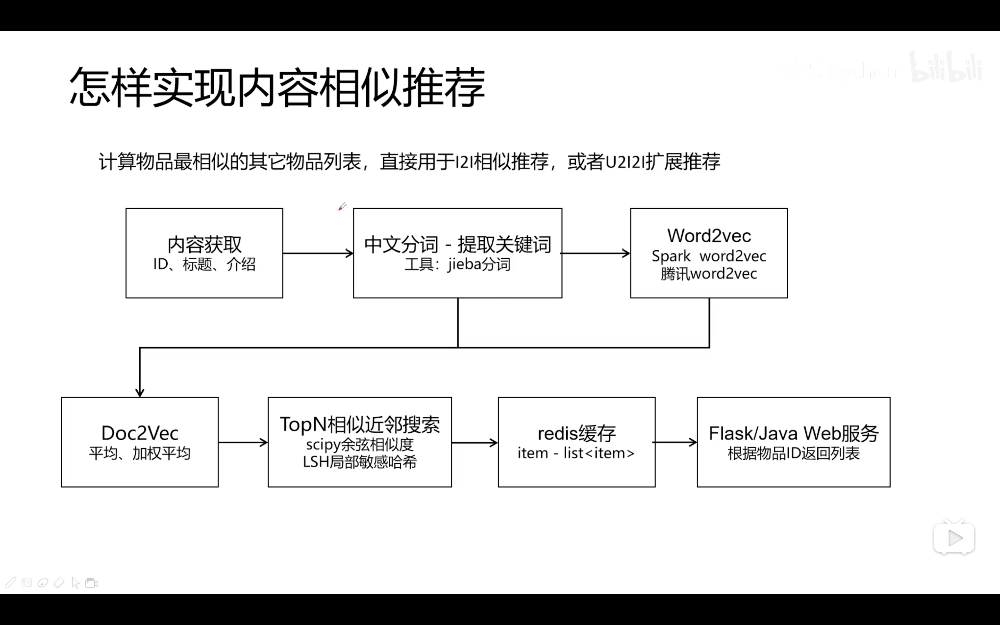

## 实现用户聚类推荐

群聚分析

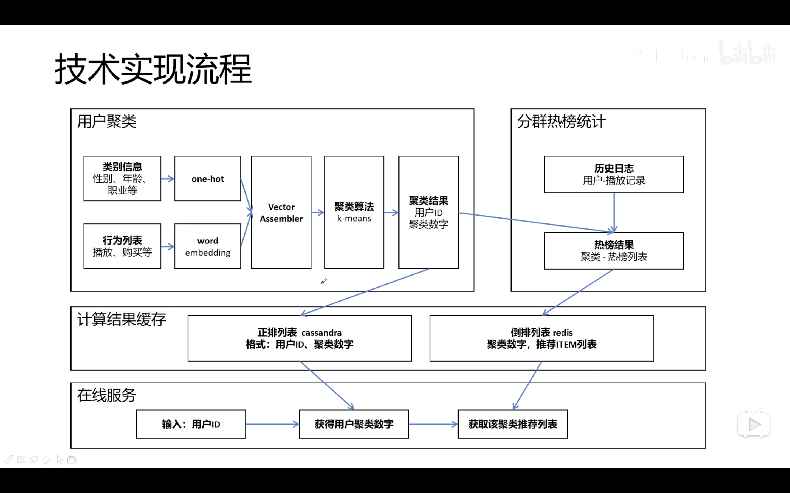

## 实现矩阵分解推荐

降维

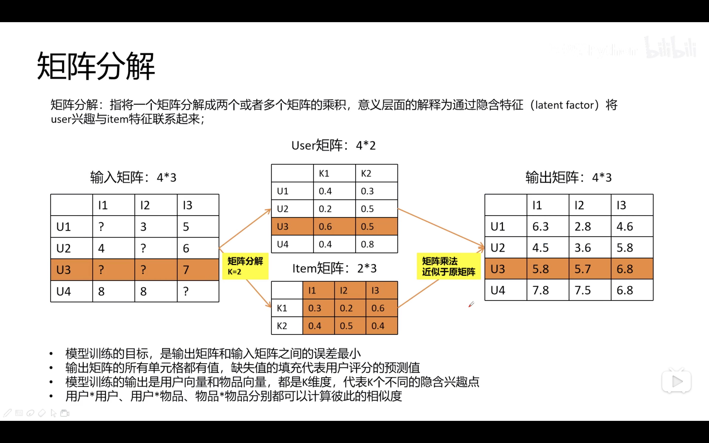

## 推荐系统 API 服务接口

猜你喜欢
相关推荐

## 物品冷启动

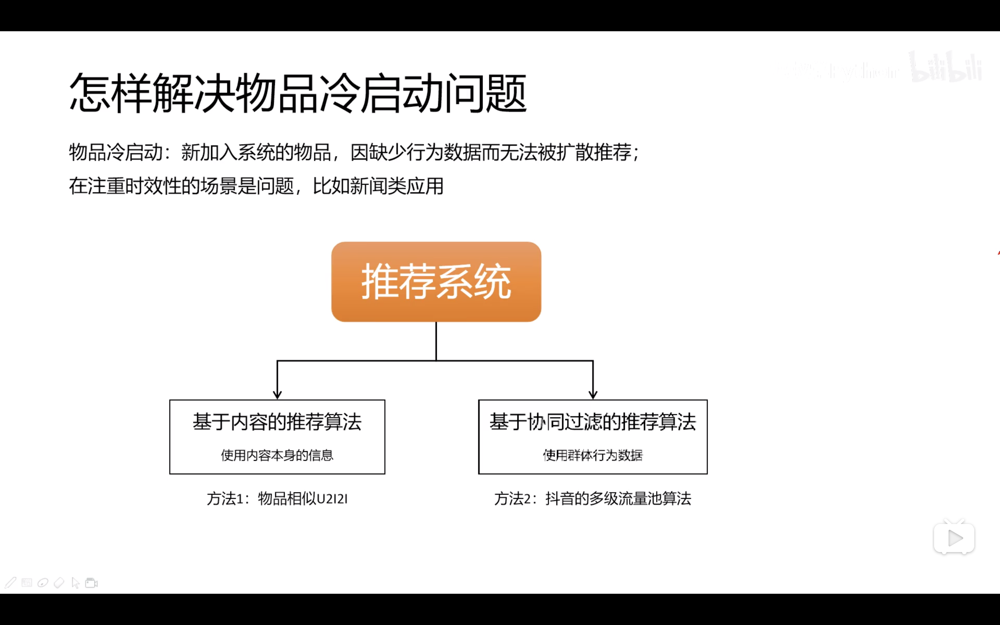

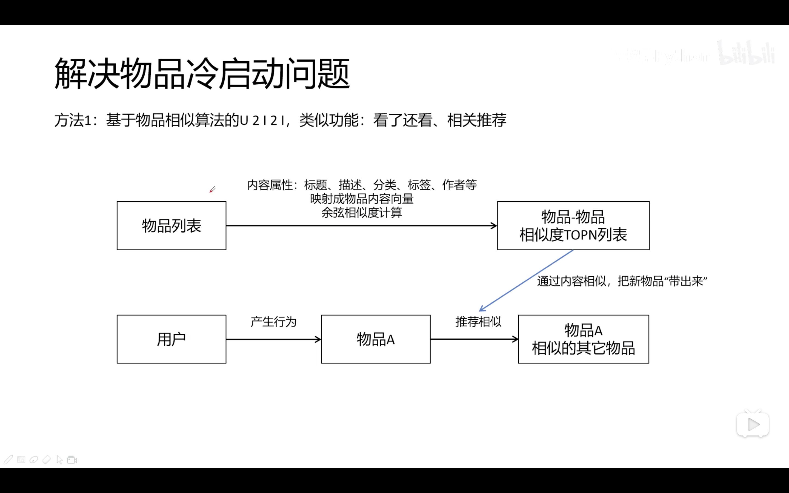

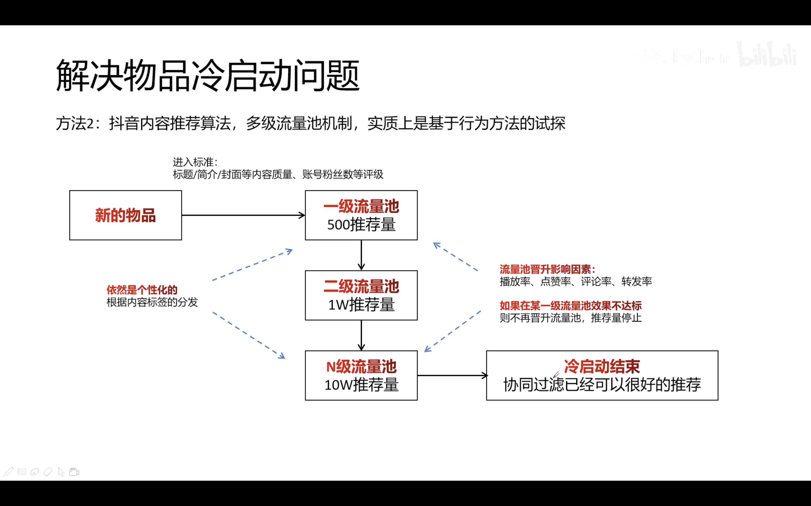

## Embedding 技术

直观上，是一个数组，元素是一个小数数字

物理意义上，每个小数代表一个兴趣强度

faiss 近邻搜索库

## 推荐系统依赖数据源与特征工程

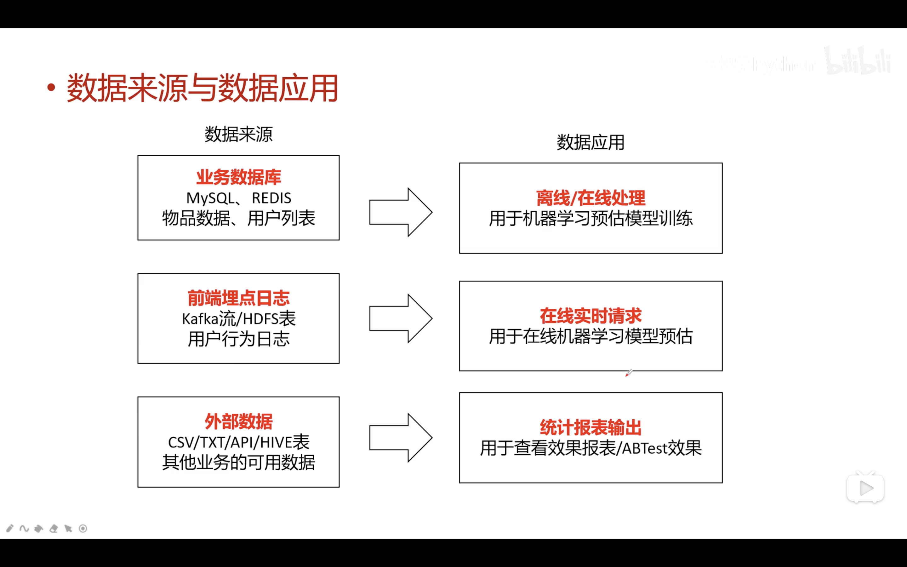

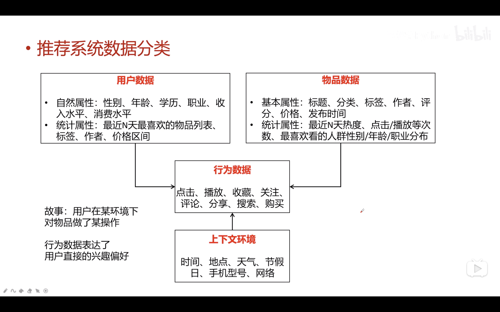

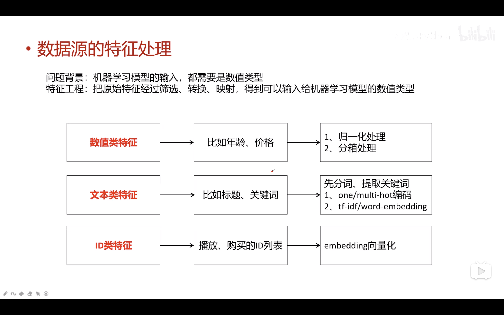

## 环境

Python
numpy
pandas
pyspark
flask
scipy
